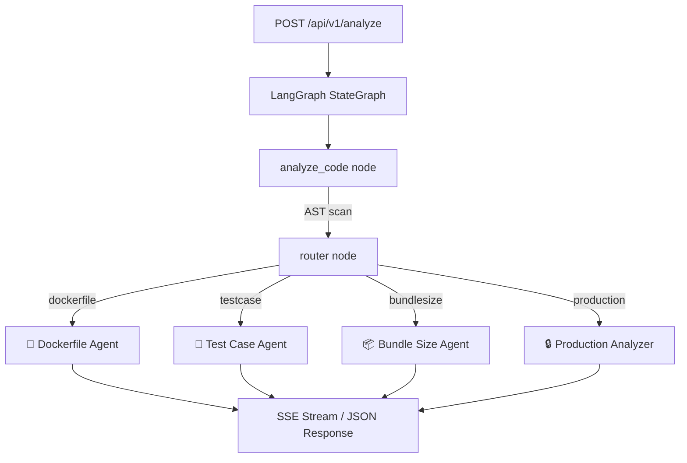

# DevOps Chatbot Backend — Walkthrough

## What Was Built

A complete FastAPI + LangGraph backend with 4 AI-powered agents for DevOps code analysis.

## Architecture



## Files Created / Modified

| File | Purpose |
|------|---------|
| [pyproject.toml](file:///home/tanishq/Documents/Development/Devops%20chatbot/backend/pyproject.toml) | Added 7 new dependencies |
| [.env.example](file:///home/tanishq/Documents/Development/Devops%20chatbot/backend/.env.example) | Template for `GOOGLE_API_KEY` |
| [app/config.py](file:///home/tanishq/Documents/Development/Devops%20chatbot/backend/app/config.py) | Pydantic Settings from `.env` |
| [app/models/schemas.py](file:///home/tanishq/Documents/Development/Devops%20chatbot/backend/app/models/schemas.py) | Request/Response/SSE models |
| [app/models/state.py](file:///home/tanishq/Documents/Development/Devops%20chatbot/backend/app/models/state.py) | LangGraph `AgentState` TypedDict |
| [app/tools/code_analyzer.py](file:///home/tanishq/Documents/Development/Devops%20chatbot/backend/app/tools/code_analyzer.py) | AST-based codebase scanner |
| [app/prompts/dockerfile.py](file:///home/tanishq/Documents/Development/Devops%20chatbot/backend/app/prompts/dockerfile.py) | Dockerfile agent system prompt |
| [app/prompts/testcase.py](file:///home/tanishq/Documents/Development/Devops%20chatbot/backend/app/prompts/testcase.py) | Test case agent system prompt |
| [app/prompts/bundlesize.py](file:///home/tanishq/Documents/Development/Devops%20chatbot/backend/app/prompts/bundlesize.py) | Bundle size agent system prompt |
| [app/prompts/production.py](file:///home/tanishq/Documents/Development/Devops%20chatbot/backend/app/prompts/production.py) | Production analyzer system prompt |
| [app/agents/router_node.py](file:///home/tanishq/Documents/Development/Devops%20chatbot/backend/app/agents/router_node.py) | Intent classifier (keywords + LLM fallback) |
| [app/agents/dockerfile_agent.py](file:///home/tanishq/Documents/Development/Devops%20chatbot/backend/app/agents/dockerfile_agent.py) | Dockerfile generation node |
| [app/agents/testcase_agent.py](file:///home/tanishq/Documents/Development/Devops%20chatbot/backend/app/agents/testcase_agent.py) | Test case generation node |
| [app/agents/bundlesize_agent.py](file:///home/tanishq/Documents/Development/Devops%20chatbot/backend/app/agents/bundlesize_agent.py) | Bundle optimization node |
| [app/agents/production_agent.py](file:///home/tanishq/Documents/Development/Devops%20chatbot/backend/app/agents/production_agent.py) | Production failure analysis node |
| [app/agents/graph.py](file:///home/tanishq/Documents/Development/Devops%20chatbot/backend/app/agents/graph.py) | LangGraph StateGraph assembly |
| [app/api/routes.py](file:///home/tanishq/Documents/Development/Devops%20chatbot/backend/app/api/routes.py) | API endpoints (JSON + SSE streaming) |
| [app/main.py](file:///home/tanishq/Documents/Development/Devops%20chatbot/backend/app/main.py) | FastAPI app factory |
| [main.py](file:///home/tanishq/Documents/Development/Devops%20chatbot/backend/main.py) | Uvicorn entry point |

## How to Run

```bash
cd backend

# 1. Create your .env file
cp .env.example .env
# Edit .env and add your GOOGLE_API_KEY

# 2. Install dependencies
uv sync

# 3. Start the server
uv run main.py
# → http://localhost:8000
# → Swagger docs at http://localhost:8000/docs
```

## API Endpoints

### `GET /health`
Liveness probe → `{"status": "healthy", "version": "0.1.0"}`

### `POST /api/v1/analyze` (JSON response)
```json
{
  "command": "generate a dockerfile for this project",
  "codebase_path": "/path/to/your/project"
}
```

### `POST /api/v1/analyze/stream` (SSE streaming)
Same body, returns Server-Sent Events with types: `progress`, `token`, `result`, `error`, `done`.

## Verification

- ✅ `uv sync` — all 44 packages installed successfully
- ✅ Server boots without errors
- ✅ `GET /health` returns 200
- ✅ Swagger docs accessible at `/docs`
- ⏳ Full LLM test requires `GOOGLE_API_KEY` in `.env`
