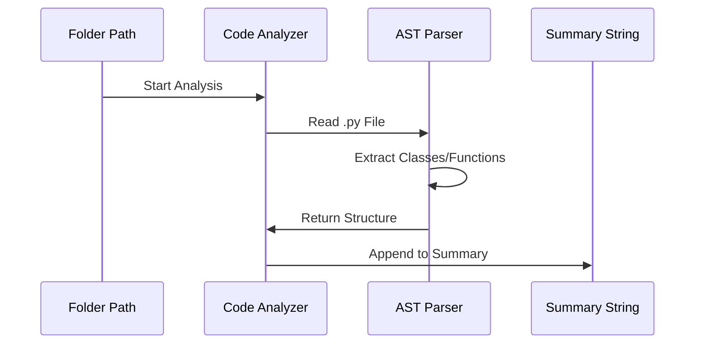

# Chapter 1: AST-Based Code Analysis

Imagine you are asking a master architect for advice on fixing a leak in your house. You wouldn't hand them every single receipt, blueprint, and photo of every brick ever laid. Instead, you'd show them a **floor plan**.

In this project, our "architect" is an AI. To help it understand your code without overwhelming it, we use **AST-Based Code Analysis**. This is the "speed-reader" of our backend that creates a floor plan of your code.

## The Problem: AI "Memory" is Limited
AI models have a "context window"—basically, a limit on how much they can remember at one time. If your project has 50 files and 10,000 lines of code, you can't just copy-paste everything. The AI would get "confused" or simply cut off the most important parts.

## The Solution: The AST "Skeleton"
Instead of reading every line of text, we use an **Abstract Syntax Tree (AST)**. 

Think of a sentence: *"The quick brown fox jumps over the lazy dog."*
*   **Raw Text:** Just a string of characters.
*   **AST view:** Identifies the **Subject** (Fox), the **Verb** (Jumps), and the **Object** (Dog).

By using ASTs, our system ignores the "fluff" (like comments or logic details) and focuses on the **structure**: What are the classes? What are the functions? What other files does this file depend on?

---

## How to Use the Code Analyzer
The main tool we use is a function called `analyze_codebase`. You give it a folder path, and it returns a compact summary.

```python
from app.tools.code_analyzer import analyze_codebase

# Give it a path to a project
summary, count = analyze_codebase("./my_project")

print(f"Analyzed {count} files!")
print(summary)
```
*This takes a folder and produces a "Map" the AI can actually read.*

### Example Output
Instead of thousands of lines of logic, the AI receives something like this:
```text
### app/models/user.py (Python)
  Class User: methods=[save, delete, get_email]
  def create_user(username, password) [L10]
```
The AI now knows *what* the code can do without having to read every single line of the implementation.

---

## How It Works Under the Hood

When you trigger an analysis, the system follows a specific path to convert files into a summary.



### 1. Identifying the File Type
First, the analyzer looks at the file extension. If it's a `.py` file, it uses Python's built-in `ast` module. If it's a configuration file (like `Dockerfile` or `package.json`), it reads it as plain text because those files are already very "dense" with info.

### 2. The "Node Visitor"
For Python files, we use a special class called a `NodeVisitor`. It "walks" through the code tree and stops only at things we care about.

```python
import ast

# A simple visitor that only looks for function names
class SimpleVisitor(ast.NodeVisitor):
    def visit_FunctionDef(self, node):
        print(f"Found a function: {node.name}")

# This tells the visitor to start walking the tree
tree = ast.parse("def hello(): pass")
SimpleVisitor().visit(tree)
```
*In `app/tools/code_analyzer.py`, we use a more advanced version of this to collect arguments and line numbers.*

### 3. Creating the Summary
The analyzer combines the tree info into a single string. It also adds a "File Tree" at the very beginning so the AI knows where every file lives in the folder structure.

---

## Why This Matters for the Workflow
In our orchestration logic (found in `app/agents/graph.py`), the very first thing that happens when you ask a question is the `analyze_code_node`.

```python
async def analyze_code_node(state: AgentState) -> dict:
    # Run the analyzer on the path provided in the state
    context, count = analyze_codebase(state["codebase_path"])
    
    # Save the summary into the "Shared Notepad"
    return {"code_context": context, "files_analyzed": count}
```
*This ensures that before the AI tries to answer, its "memory" is already populated with the project's floor plan.*

## Summary
*   **ASTs** help us see the structure of code (Classes/Functions) instead of just raw text.
*   We use this to **shrink** a large codebase into a small summary.
*   This summary is stored in the [AgentState (The Shared Notepad)](02_agentstate__the_shared_notepad__.md) so all AI agents can access it.

In the next chapter, we will learn how this summary is stored and shared between different AI "experts" using the **AgentState**.

[Next Chapter: AgentState (The Shared Notepad)](02_agentstate__the_shared_notepad__.md)

---

Generated by [AI Codebase Knowledge Builder](https://github.com/The-Pocket/Tutorial-Codebase-Knowledge)