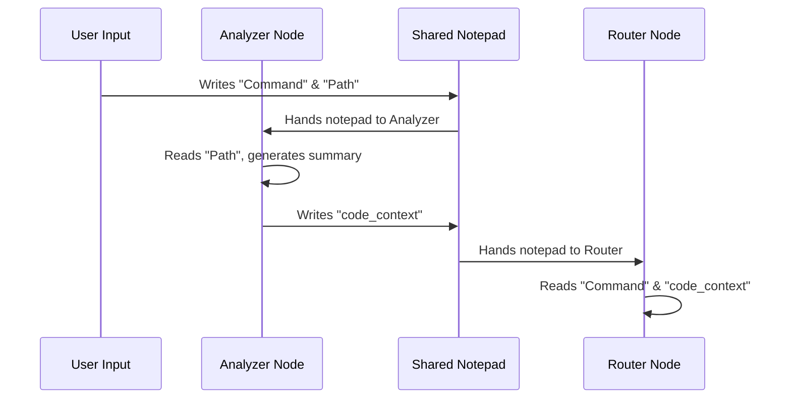

# Chapter 2: AgentState (The Shared Notepad)

In [AST-Based Code Analysis](01_ast_based_code_analysis_.md), we learned how to create a "floor plan" or summary of a codebase. But once that summary is created, where does it go? How does the AI agent that writes Dockerfiles see the summary created by the Code Analyzer?

The answer is the **AgentState**.

## The Problem: AI "Amnesia"
Imagine a relay race where runners have to solve a puzzle together. 
*   **Runner 1 (Code Analyzer)** looks at the code and finds out it's a Python project.
*   **Runner 2 (The Router)** needs to decide which expert to call.
*   **Runner 3 (The Expert)** needs to write the actual code.

If Runner 1 finishes their lap but doesn't hand over a note saying "It's a Python project!", Runner 2 and 3 will have no idea what's going on. They have "amnesia." Without a shared memory, every single part of our system would have to re-analyze the code from scratch, wasting time and money.

## The Solution: The Shared Notepad
The **AgentState** is like a digital notepad passed from hand to hand. In our `backend` project, this notepad is a central "Source of Truth." 

When one component (we call these **Nodes**) finishes its job, it writes its findings onto the notepad and passes it to the next node.

### What’s on the Notepad?
Our notepad (found in `app/models/state.py`) keeps track of several important things:

1.  **The Goal:** What did the user ask for? (`command`)
2.  **The Map:** Where is the code located? (`codebase_path`)
3.  **The Findings:** The summary we created in Chapter 1. (`code_context`)
4.  **The Decision:** Which agent should handle this? (`intent`)
5.  **The Conversation:** What has been said so far? (`messages`)

---

## How the Notepad is Built
In Python, we define this notepad using a `TypedDict`. This is just a fancy way of telling our program: "This dictionary must always have these specific labels."

```python
from typing import TypedDict, Annotated
import operator

class AgentState(TypedDict):
    command: str          # The user's request
    codebase_path: str    # Path to the folder
    code_context: str     # The AST summary from Chapter 1
    intent: str           # The goal (e.g., "dockerfile")
    result: str           # The final answer
```
*This defines the structure of our notepad. Every agent knows exactly where to look for the `code_context`.*

### Handling a Growing History
Sometimes, we don't want to overwrite what's on the notepad; we want to **add** to it. For example, we want to keep a list of every message sent.

```python
from langchain_core.messages import BaseMessage

# This tells the notepad: "Don't replace the list, 
# just add new messages to the end of it."
messages: Annotated[list[BaseMessage], operator.add]
```
*The `operator.add` part is the magic that lets the notepad grow longer as the conversation continues.*

---

## How to Use the Notepad
You don't "send" the notepad manually. Instead, in our workflow, each function (Node) receives the current state and returns only the **new information** it wants to add.

### Example: Writing to the Notepad
Look at how the `analyze_code_node` from `app/agents/graph.py` updates the state:

```python
async def analyze_code_node(state: AgentState):
    # 1. Read the path from the notepad
    path = state["codebase_path"]
    
    # 2. Do the work
    summary, count = analyze_codebase(path)
    
    # 3. Return the new notes to be added
    return {"code_context": summary, "files_analyzed": count}
```
*The system automatically takes that return value and "clips" it onto the shared notepad for the next agent to see.*

---

## How It Works Under the Hood

The AgentState moves through the system in a specific order. Here is how the "Notepad" is passed around:



### 1. Initialization
When you first type a message in the chat, the system creates the notepad and fills in the `command` and `codebase_path`.

### 2. The Hand-off
The `StateGraph` (which we will cover in [StateGraph Orchestration](04_stategraph_orchestration_.md)) manages the hand-off. It ensures that when the `analyze_code_node` finishes, the updated notepad is immediately ready for the `router_node`.

### 3. Persistence
Because the notepad is a structured object, we can save it to a database. This is how the AI "remembers" what you talked about yesterday—it just reloads the old notepad!

---

## Why This Matters
By using a Shared Notepad (AgentState):
*   **Consistency:** The Specialist Agent sees the *exact same* code summary that the Router saw.
*   **Efficiency:** We only run the expensive [AST-Based Code Analysis](01_ast_based_code_analysis_.md) once.
*   **Debugging:** If the AI gives a wrong answer, we can look at the notepad to see exactly where the information went wrong.

## Summary
*   **AgentState** is a shared dictionary that acts as the "Source of Truth."
*   It prevents **AI Amnesia** by passing information between nodes.
*   Nodes **read** what they need and **return** what they discovered to update the state.
*   It keeps our system organized and efficient.

Now that we have a place to store our information, how does the system decide what to do next? In the next chapter, we'll look at how the Router reads the notepad to make smart decisions.

[Next Chapter: Intelligent Intent Routing](03_intelligent_intent_routing_.md)

---

Generated by [AI Codebase Knowledge Builder](https://github.com/The-Pocket/Tutorial-Codebase-Knowledge)