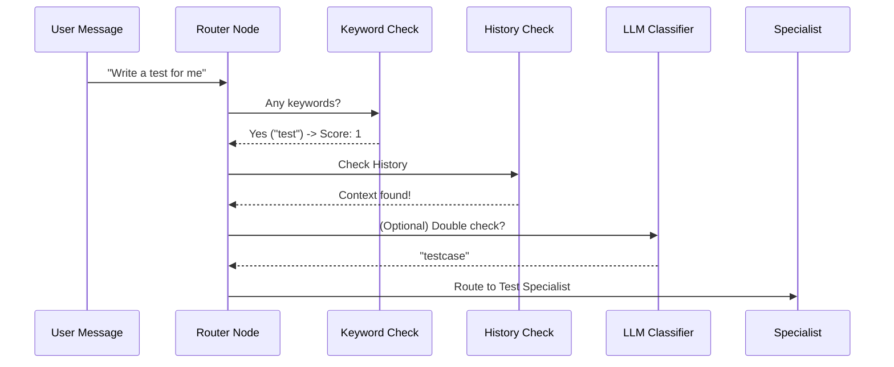

# Chapter 3: Intelligent Intent Routing

In [AgentState (The Shared Notepad)](02_agentstate__the_shared_notepad__.md), we learned how the system stores information in a central "notepad." But having a notepad full of information is only useful if you know who should read it next. 

This is where **Intelligent Intent Routing** comes in.

## The Problem: The "Expensive Expert" Tax
Imagine you walk into a high-end hospital. You don't need a world-class neurosurgeon to tell you where the restroom is, and you don't want to pay their hourly rate for a simple greeting.

In AI systems, "Specialist Agents" (like one that writes complex Dockerfiles) are like neurosurgeons. They are powerful but "expensive" in terms of processing time and cost. If a user just says "Hello" or "How are you?", we shouldn't wake up the specialists. We need a way to sort requests.

## The Solution: The Hotel Concierge
The **Router** acts like a hotel concierge. When you speak to it, it quickly decides:
1.  **Can I handle this with a quick rule?** (Keywords)
2.  **Does the history explain what they want?** (Context)
3.  **Do I need to ask a smart assistant to classify this?** (LLM Fallback)

If the request is clearly about a specific task, it sends it to a **Specialist**. Otherwise, it defaults to a **General Assistant**.

---

## Concept 1: Keyword Routing (The "Fast Lane")
The fastest way to route a request is to look for specific "trigger words." This costs almost nothing and happens instantly.

```python
# A simple map of keywords to specialist topics
INTENT_KEYWORDS = {
    "dockerfile": ["docker", "container", "image"],
    "testcase": ["test", "pytest", "unittest"],
    "bundlesize": ["size", "optimize", "package"]
}
```
*If your message contains "docker", the router immediately suspects you need the Docker specialist.*

### Scoring the Intent
We don't just look for one word; we look for "strength." If you use two or more keywords, we are much more confident.

```python
def get_score(command, keywords):
    # Count how many keywords appear in the user's command
    return sum(1 for kw in keywords if kw in command.lower())

# Example: "Build a docker image" -> Score: 2 (docker, image)
```
*A higher score means we are more certain about which expert to call.*

---

## Concept 2: Context Awareness (The "Memory")
Sometimes the current message is too short to understand. 
*   **User:** "Fix it."
*   **Router:** "Fix what?"

By looking at the `conversation_history` stored in the [AgentState (The Shared Notepad)](02_agentstate__the_shared_notepad__.md), the router can see that 30 seconds ago, you were talking about a **Dockerfile**. It "remembers" the context and routes the "Fix it" request to the Docker expert.

---

## Concept 3: The LLM Fallback (The "Smart Guess")
If there are no keywords and the history is empty, the Router uses a small, fast AI model (LLM) to make a final decision. It uses a specific "Routing Prompt" to ask the AI: *"Is this about Docker, Testing, or just Chatting?"*

```python
# We send the command to the LLM with a specialized instruction
response = await llm.ainvoke([
    SystemMessage(content="Classify this: docker, test, or general"),
    HumanMessage(content="How do I make my app smaller?")
])
# The AI replies: "bundlesize"
```
*This catches complex requests like "Make my app smaller," which doesn't use the word "bundle" but implies it.*

---

## How It Works Under the Hood

The router follows a strict hierarchy to be as efficient as possible.



### 1. The Decision Logic
In `app/agents/router_node.py`, the system runs through these steps in order:

1.  **Explicit Mode:** Did the user manually select a mode (e.g., "Always use Docker mode")?
2.  **Context Check:** Does the recent history suggest a topic?
3.  **Keyword Match:** Are there strong "trigger words" in the command?
4.  **LLM Fallback:** If still unsure, ask the AI to classify the intent.

### 2. Normalizing the Output
To make sure the rest of the system understands the decision, the router "normalizes" the result. Even if the AI says "I think it's a DOCKER file!", the router cleans it up to exactly `"dockerfile"`.

---

## Why This Matters
By using Intelligent Intent Routing:
*   **Speed:** Simple questions get answered faster because they don't go through complex logic.
*   **Accuracy:** Specialists only see requests they are trained for.
*   **Efficiency:** We save "AI brain power" for the hard problems, making the whole system cheaper and more scalable.

## Summary
*   **Routing** is the process of picking the best expert for the job.
*   We use **Keywords** for speed and **LLMs** for accuracy.
*   We use **Context** from the [AgentState](02_agentstate__the_shared_notepad__.md) to understand short messages.
*   When in doubt, we default to **General** to keep things simple.

Now that the Router has decided *who* should handle the request, how do we actually move the data to that expert? In the next chapter, we'll see how the "Map" of our system is drawn.

[Next Chapter: StateGraph Orchestration](04_stategraph_orchestration_.md)

---

Generated by [AI Codebase Knowledge Builder](https://github.com/The-Pocket/Tutorial-Codebase-Knowledge)