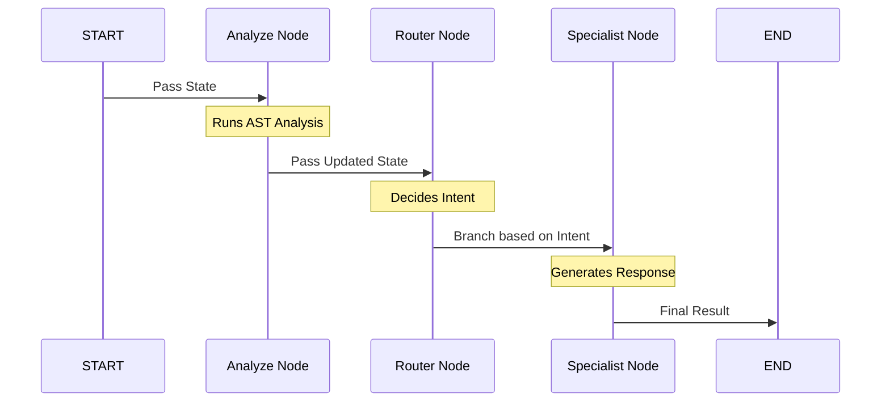

# Chapter 4: StateGraph Orchestration

In [Intelligent Intent Routing](03_intelligent_intent_routing_.md), we learned how the system decides which expert should handle a request. But how does the data actually travel from the code analyzer to the router, and then to the correct expert? 

The answer is **StateGraph Orchestration**.

## The Problem: The "Spaghetti Code" Trap
Imagine you are building a factory. You have a machine that cleans parts, a machine that paints them, and a machine that boxes them. 

Without a conveyor belt, you would have workers running around randomly, asking, "Is this part clean yet?" or "Where do I take this painted box?" As you add more machines (like a "gift wrap" machine), the confusion grows. This is "spaghetti code"—a mess of `if` statements and manual function calls that is hard to maintain.

## The Solution: The Subway System
**StateGraph** (from the LangGraph library) is the conveyor belt or "subway system" of our application. It defines a structured path that our [AgentState (The Shared Notepad)](02_agentstate__the_shared_notepad__.md) follows.

1.  **Nodes:** These are the "Stations" (functions) where work happens.
2.  **Edges:** These are the "Tracks" that connect one station to the next.
3.  **The State:** This is the "Passenger" carrying the notepad between stations.

---

## Concept 1: Defining the Stations (Nodes)
A node is simply a Python function. When the "passenger" arrives at a node, the function runs, updates the notepad, and sends the passenger back to the track.

```python
# We tell the graph: "There is a station called 'router'"
# and it uses the 'router_node' function logic.
workflow.add_node("router", router_node)

# We also add our specialists as stations
workflow.add_node("dockerfile", dockerfile_node)
workflow.add_node("testcase", testcase_node)
```
*Each node is a modular block. You can add a new "security_expert" node without touching the logic of the "dockerfile" node.*

---

## Concept 2: Building the Tracks (Edges)
Edges define the sequence. A "Normal Edge" is a one-way track that always goes from Point A to Point B.

```python
from langgraph.graph import START

# This track always goes from the START to the analyzer
workflow.add_edge(START, "analyze_code")

# Once analysis is done, it always goes to the router
workflow.add_edge("analyze_code", "router")
```
*This ensures that [AST-Based Code Analysis](01_ast_based_code_analysis_.md) always happens before we try to route the request.*

---

## Concept 3: The Fork in the Road (Conditional Edges)
Sometimes, the track needs to split. This is where we use the routing logic from Chapter 3. Depending on what is written on the notepad, the passenger takes a different turn.

```python
# 'route_by_intent' looks at the notepad's 'intent' field
workflow.add_conditional_edges(
    "router",
    route_by_intent,
    {
        "dockerfile": "dockerfile",
        "testcase": "testcase",
        "general": "general"
    }
)
```
*If the intent is "dockerfile", the graph moves the state to the `dockerfile_node`. This is like a subway switch turning to the right track.*

---

## How to Use the Graph
In our `backend` project, we wrap all this setup into a function called `build_graph()`. Once built, we "compile" it, which turns it into a single object we can run.

```python
# 1. Initialize the graph with our state structure
workflow = StateGraph(AgentState)

# 2. Add nodes and edges (as shown above)
# ... code to add nodes/edges ...

# 3. Compile it into a runnable app
app = workflow.compile()
```
*The compiled `app` can now take a user request and handle the entire lifecycle—from analysis to the final answer—automatically.*

---

## How It Works Under the Hood

When you send a message, the StateGraph manages the entire "trip" of your data.



### 1. Starting the Engine
In `app/agents/graph.py`, the flow begins at the `START` symbol. The system looks at the first edge and sees it points to `analyze_code`.

### 2. The Shared Notepad Update
As the state moves into `analyze_code_node`, it performs the analysis we learned in [Chapter 1](01_ast_based_code_analysis_.md). It returns a dictionary like `{"code_context": "..."}`. The graph automatically merges this into the [AgentState](02_agentstate__the_shared_notepad__.md).

### 3. The Router Decision
The state then enters the `router_node`. This node doesn't change the code context; it just adds an `intent` (like `"testcase"`) to the notepad.

### 4. Reaching the Destination
The `Conditional Edge` reads that `intent` and teleports the state to the `testcase_node`. Once that node finishes, it points to `END`, and the final result is sent back to the user.

---

## Why This Matters
By using StateGraph Orchestration:
*   **Predictability:** We know exactly what order things happen in.
*   **Modularity:** If we want to add a "Code Reviewer" agent, we just add a new node and a track leading to it.
*   **Visual Clarity:** We can literally draw our AI's logic as a map, making it much easier to explain to other developers.

## Summary
*   **StateGraph** is the "brain" that organizes how data flows through the system.
*   **Nodes** are stations where specific functions run.
*   **Edges** are the tracks connecting the stations.
*   **Conditional Edges** use the [Intelligent Intent Routing](03_intelligent_intent_routing_.md) to choose the right path.

Now that our "Subway System" is built and our agents are in their stations, how do we make sure the agents give high-quality answers? In the next chapter, we'll look at the "Scripts" our agents follow.

[Next Chapter: Markdown Prompt Library](05_markdown_prompt_library_.md)

---

Generated by [AI Codebase Knowledge Builder](https://github.com/The-Pocket/Tutorial-Codebase-Knowledge)