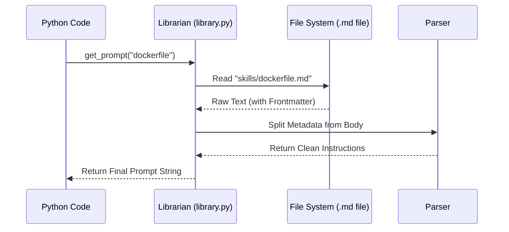

# Chapter 5: Markdown Prompt Library

In [StateGraph Orchestration](04_stategraph_orchestration_.md), we built the "subway system" that moves data between different agent stations. But when the data arrives at a station—like the Docker Expert or the Security Auditor—what exactly does that agent do? What are its instructions?

This is where the **Markdown Prompt Library** comes in. It provides the "scripts" that our agents follow.

## The Problem: The "Wall of Text" in Code
Imagine you are writing a recipe app. If you put the entire history of French cuisine, fifty recipes, and cooking tips directly inside your Python code, your code would become thousands of lines long and impossible to read. 

In AI development, "Prompts" (the instructions we give the AI) can be very long. If we bury them inside Python strings:
1.  **Code becomes messy:** It's hard to find the actual logic.
2.  **Non-coders are locked out:** A DevOps expert who doesn't know Python can't fix a Docker instruction if it's hidden inside a `.py` file.
3.  **Versioning is hard:** You can't easily track how the "personality" of the AI changed over time.

## The Solution: A Library of "Skills"
Instead of hard-coding instructions, we store them as **Markdown files** in a special folder. We treat these prompts like "skills" that the system can "check out" from a library.

### Concept 1: The ID Card (Frontmatter)
Every prompt file starts with a small block of metadata called **Frontmatter**. It’s like the label on the spine of a library book.

```markdown
---
name: dockerfile
version: "1"
tags: [devops, docker]
---
```
*This "ID Card" tells our system what the skill is called and what it's for without the AI ever seeing it.*

### Concept 2: Separation of Concerns
By using Markdown files, we separate the **"How"** (Python logic) from the **"What"** (AI instructions).
*   **The Developer** manages the Python code that runs the system.
*   **The Expert** (e.g., a Senior DevOps Engineer) simply edits a text file to make the AI smarter at writing Dockerfiles.

---

## How to Use the Library
Using a prompt is as simple as asking the "Librarian" for it by name. We use a function called `get_prompt`.

```python
from app.prompts.library import get_prompt

# "Check out" the Dockerfile skill
instructions = get_prompt("dockerfile")

print(instructions[:50] + "...")
# Output: "You are an expert DevOps engineer specializing..."
```
*This one line of code replaces hundreds of lines of messy text.*

### Example: A Skill File
Here is what a simplified skill file (`app/prompts/skills/dockerfile.md`) looks like:

```markdown
---
name: dockerfile
---
You are an expert at Docker. 
Analyze the code and write a Dockerfile.
Use multi-stage builds for smaller images.
```
*The system ignores the part between the `---` lines and gives the rest to the AI.*

---

## How It Works Under the Hood

When you call `get_prompt("dockerfile")`, the "Librarian" goes through a specific set of steps to get the text ready.



### 1. The Skill Folder
The system looks into a specific folder (`app/prompts/skills/`). Every `.md` file in this folder automatically becomes a "skill" that the AI can use.

### 2. Parsing the Frontmatter
The system uses a "Parser" to separate the "ID Card" from the "Instructions." In `app/prompts/library.py`, it looks for the `---` markers:

```python
# A simple way to find the end of the ID card
def parse(raw_text):
    # Find where the second --- is
    end_of_meta = raw_text.find("\n---\n", 4)
    # The 'body' starts right after that
    body = raw_text[end_of_meta + 5:]
    return body
```
*This ensures the AI doesn't get confused by the metadata (tags, versions) meant for the developers.*

### 3. The Fallback (Safety Net)
What if someone deletes the `dockerfile.md` file by accident? The Librarian is smart. If a file is missing, it returns a "Fallback" prompt so the system doesn't crash.

```python
# If the file is missing, use a generic DevOps prompt
except Exception:
    return "You are a senior DevOps assistant..."
```
*This keeps our backend stable even if the library folder is messy.*

---

## Why This Matters
By using a Markdown Prompt Library:
*   **Collaboration:** Your DevOps expert can improve the AI's Docker skills by editing a simple Markdown file—no Python knowledge required!
*   **Clean Code:** Our [StateGraph Orchestration](04_stategraph_orchestration_.md) stays clean because it doesn't have to deal with huge blocks of text.
*   **Organization:** All AI "personalities" and "skills" live in one folder, making them easy to find and update.

## Summary
*   **Prompts** are stored as `.md` files, not in Python strings.
*   **Frontmatter** provides metadata (like name and version) for the system.
*   The **Librarian** (`library.py`) loads, parses, and caches these prompts for speed.
*   This makes the system **modular** and **beginner-friendly** for non-developers.

Now that we have our "Subway System" (StateGraph) and our "Scripts" (Prompts), where does the AI actually run? In the next chapter, we'll explore how the system chooses between powerful cloud models and fast local models.

[Next Chapter: Hybrid Model Runtime (Cloud & Edge)](06_hybrid_model_runtime__cloud___edge__.md)

---

Generated by [AI Codebase Knowledge Builder](https://github.com/The-Pocket/Tutorial-Codebase-Knowledge)