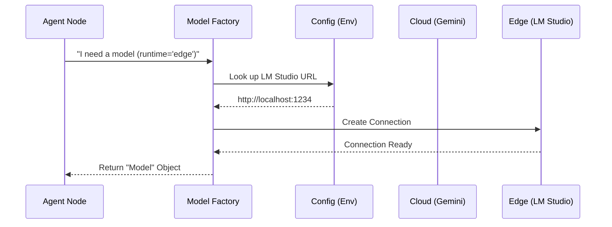

# Chapter 6: Hybrid Model Runtime (Cloud & Edge)

In [Markdown Prompt Library](05_markdown_prompt_library_.md), we learned how to give our agents "scripts" to follow. But even the best script needs an actor to perform it. In the world of AI, that "actor" is the Large Language Model (LLM).

In this chapter, we’ll explore how our backend switches between different "actors"—from powerful cloud-based models to private, local models running on your own computer.

## The Problem: The "All-or-Nothing" Dilemma
Imagine you have a smart microwave. 
*   **The Cloud approach:** Every time you want to pop popcorn, the microwave sends a request to a massive supercomputer in another country to ask, "How long should I cook this?" It's smart, but if your internet goes down, you're hungry.
*   **The Local approach:** The microwave has a tiny chip inside. It's fast and private, but it might not know the difference between popcorn and a potato.

In development, you often want the **Cloud** (like Google Gemini) for complex logic, but you want the **Edge** (a local model via LM Studio) for privacy or to save money during testing. Changing your code every time you switch is a nightmare.

## The Solution: The Power Adapter
The **Hybrid Model Runtime** acts like a universal power adapter. Our agents don't care where the "electricity" (the AI's intelligence) comes from. They just plug into the **Model Factory**, and the factory decides whether to pull power from the "Grid" (Cloud) or a "Battery" (Edge/Local).

---

## Concept 1: The Factory Pattern
Instead of agents creating their own AI connections, they ask a central **Factory** for a model. This keeps the agents "clean" and focused only on their jobs.

```python
# The agent just says: "Give me a cloud model, please."
model = build_chat_model(runtime="cloud", temperature=0.7)

# Or: "I'm offline, give me an edge model."
model = build_chat_model(runtime="edge", temperature=0.7)
```
*The agent doesn't need to know the API keys or URLs; the factory handles the dirty work.*

---

## Concept 2: The "Edge" (Local AI)
When we talk about "Edge," we usually mean running a model on your own laptop using a tool like **LM Studio**. Our backend treats LM Studio as if it were a professional cloud service, even though it's running right next to your code.

```python
# In app/config.py, we define where the local model lives
settings.lmstudio_base_url = "http://127.0.0.1:1234/v1"
```
*This allows the system to talk to your own computer instead of the internet.*

---

## How to Use the Factory
In our specialists (like the Docker expert), we use the factory to generate answers. The runtime choice usually comes from a setting or a user toggle.

```python
# Example: Creating a model based on a choice
from app.llm.factory import build_chat_model

# We get a model ready to go
llm = build_chat_model(runtime="cloud", temperature=0.1)

# Now we can just use it!
response = await llm.ainvoke("Write a Dockerfile for Python")
```
*Because both Cloud and Edge models follow the same "rules," the rest of our code doesn't have to change at all.*

---

## How It Works Under the Hood

The Factory is the gatekeeper. It checks the configuration and builds the specific "package" needed to talk to the chosen provider.



### 1. The Configuration (The "Map")
Everything starts in `app/config.py`. It stores the API keys for the Cloud and the local addresses for the Edge.

```python
class Settings(BaseSettings):
    google_api_key: str = "..." # For Cloud
    lmstudio_base_url: str = "..." # For Edge
```

### 2. The Builder (The "Logic")
In `app/llm/factory.py`, the `build_chat_model` function uses a simple `if` statement to decide which "Class" to create.

```python
def build_chat_model(runtime, temperature):
    if runtime == "cloud":
        # Returns a Google-specific object
        return ChatGoogleGenerativeAI(...)
    if runtime == "edge":
        # Returns an OpenAI-compatible local object
        return ChatOpenAI(base_url=settings.lmstudio_base_url, ...)
```
*Notice how the Edge uses `ChatOpenAI`. Many local tools like LM Studio "pretend" to be OpenAI so they are easier to plug in!*

### 3. The Health Check
Before we try to use the Edge, we have a helper in `app/llm/runtime.py` that "pings" your local machine to see if LM Studio is actually running.

```python
# In app/llm/runtime.py
def get_edge_runtime_status():
    # It tries to reach the local URL
    # If it fails, it returns "Not Reachable"
    ... 
```
*This prevents the app from crashing if you forgot to turn on your local AI.*

---

## Why This Matters
By using a Hybrid Model Runtime:
*   **Cost Control:** Use local models for basic tasks and expensive cloud models only when you need "big brain" logic.
*   **Privacy:** Keep sensitive code on your own machine by using the Edge runtime.
*   **Reliability:** If the cloud is down, you can switch to local and keep working.
*   **Flexibility:** You can upgrade your model (e.g., from Gemini Flash to Gemini Pro) just by changing one line in a `.env` file.

## Summary
*   **Hybrid Runtime** lets us switch between Cloud (Internet) and Edge (Local) AI.
*   The **Factory** (`factory.py`) hides the complexity from our agents.
*   **LM Studio** is our primary tool for running models locally on the "Edge."
*   Our agents stay "model-agnostic," meaning they don't care which AI is answering.

Now that our agents have their "brains" (LLMs) and their "scripts" (Prompts), how do we show their work to the user as it happens? In the next chapter, we’ll learn how to stream text in real-time so the user doesn't have to wait for the whole answer to finish.

[Next Chapter: Real-time SSE Streaming](07_real_time_sse_streaming_.md)

---

Generated by [AI Codebase Knowledge Builder](https://github.com/The-Pocket/Tutorial-Codebase-Knowledge)