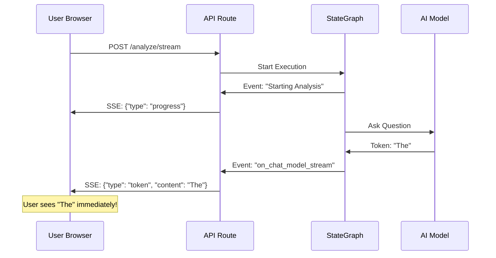

# Chapter 7: Real-time SSE Streaming

In [Hybrid Model Runtime (Cloud & Edge)](06_hybrid_model_runtime__cloud___edge__.md), we learned how to give our agents "brains" by connecting them to AI models. But if you've ever used an AI, you know it can take a few seconds (or even a minute) to finish a long answer. 

In this chapter, we’ll learn how to use **Server-Sent Events (SSE)** to show the user what the AI is thinking *as it happens*.

## The Problem: The "Spinner of Doom"
Imagine you are at a restaurant.
*   **Without Streaming:** You order your food, and the waiter disappears. You sit in silence for 30 minutes. You don't know if they started cooking or if they forgot your order. Finally, they bring everything at once.
*   **With Streaming:** The waiter brings you water immediately. Then they stop by to say, "The chef is chopping the vegetables." Then they bring the appetizer while the main course is still cooking.

In a web app, waiting for a single, giant JSON response feels slow and broken. Users hate "Spinners of Doom." We need a way to send updates piece-by-piece.

## The Solution: The "Live Delivery Tracker"
**Server-Sent Events (SSE)** is a technology that allows the server to keep a "pipe" open to the user's browser. Instead of one big delivery, the server sends a stream of small "events."

In our backend, we use this to send three things:
1.  **Progress Updates:** "🔍 Analyzing codebase..."
2.  **Tokens:** The actual words of the AI response as they are generated.
3.  **Final Result:** The completed data and metadata.

---

## Concept 1: The Streaming Response
In a normal API, you `return` a value. In a streaming API, you `yield` values. This tells the server: "Don't hang up yet! I have more info coming."

```python
from fastapi.responses import StreamingResponse

@router.post("/analyze/stream")
async def analyze_stream(request: AnalyzeRequest):
    # This returns a "live pipe" to the user
    return StreamingResponse(
        event_generator(), 
        media_type="text/event-stream"
    )
```
*The `text/event-stream` type is a special signal that tells the browser to stay on the line.*

---

## Concept 2: The Event Generator
The generator is a special function that "yields" data in a specific format that the browser understands. We use a helper called `_sse` to format these messages.

```python
def _sse(data: dict) -> str:
    # Convert a dictionary into a string that SSE requires
    import json
    return f"data: {json.dumps(data)}\n\n"

# Example usage:
# yield _sse({"type": "progress", "content": "Scanning..."})
```
*Every SSE message must start with `data: ` and end with two newlines (`\n\n`).*

---

## How to Use the Stream
When our [StateGraph Orchestration](04_stategraph_orchestration_.md) runs, it emits "events" every time a node starts or a model speaks a word. We catch these events and pass them to the user.

```python
# We ask the graph to stream its internal events
async for event in graph.astream_events(initial_state, version="v2"):
    kind = event["event"]
    
    # If the AI model is speaking...
    if kind == "on_chat_model_stream":
        token = event["data"]["chunk"].content
        yield _sse({"type": "token", "content": token})
```
*This allows the user to see the AI's response word-by-word, which feels much faster than waiting for the whole paragraph.*

---

## How It Works Under the Hood

The streaming process involves a constant loop between the AI's brain and the user's screen.



### 1. Connecting the Pipe
When the user hits the `/analyze/stream` endpoint in `app/api/routes.py`, the backend doesn't run the logic immediately. Instead, it returns a `StreamingResponse` object that points to an `event_generator` function.

### 2. Listening to the Graph
Inside the generator, we run `graph.astream_events`. This is a powerful feature of LangGraph that lets us "spy" on the internal workings of our agents. 

```python
# Checking if a specific agent node has started
if kind == "on_chain_start" and name == "dockerfile":
    yield _sse({
        "type": "progress", 
        "content": "🐳 Generating Dockerfile..."
    })
```
*By watching the `name` of the event, we can tell the user exactly which specialist from [Intelligent Intent Routing](03_intelligent_intent_routing_.md) is currently working.*

### 3. Cleaning the Tokens
AI models sometimes send metadata or empty chunks. Our code in `_content_to_text` (found in `app/api/routes.py`) makes sure we only send the actual text to the user, keeping the UI clean.

---

## Why This Matters
By using Real-time SSE Streaming:
*   **Better UX:** The app feels responsive. Even if the full task takes 20 seconds, the user sees progress in 1 second.
*   **Transparency:** Users can see the [Intelligent Intent Routing](03_intelligent_intent_routing_.md) in action (e.g., "Routed to Docker specialist").
*   **Reduced Anxiety:** Knowing the system is "Scanning source files" is much better than looking at a blank screen.

## Summary
*   **SSE** is a one-way street for sending live updates from the server to the user.
*   We use **`StreamingResponse`** and **`yield`** to keep the connection open.
*   **`astream_events`** lets us peek inside the [StateGraph Orchestration](04_stategraph_orchestration_.md) while it's running.
*   We stream **Progress** (what's happening), **Tokens** (the words), and **Results** (the end).

Now that we have a fast-feeling, real-time AI, what happens when the user closes their browser? How do we make sure their chat doesn't disappear? In the next chapter, we’ll learn how to save these conversations forever.

[Next Chapter: Persistent Chat Store](08_persistent_chat_store_.md)

---

Generated by [AI Codebase Knowledge Builder](https://github.com/The-Pocket/Tutorial-Codebase-Knowledge)