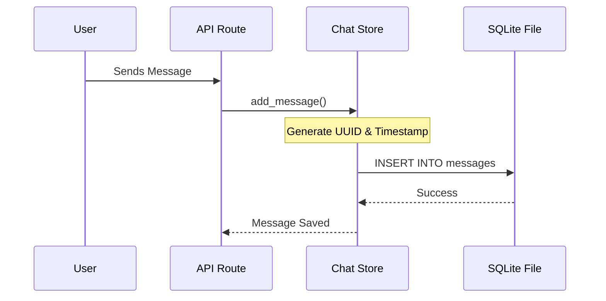

# Chapter 8: Persistent Chat Store

In [Real-time SSE Streaming](07_real_time_sse_streaming_.md), we learned how to show the AI's thoughts to the user as they happen. It feels fast and alive! But there is one big problem: if you refresh your browser or the server restarts, that beautiful conversation vanishes like a ghost.

This is where the **Persistent Chat Store** comes in. It gives our AI a "permanent memory."

## The Problem: The "Dory" Effect
Imagine talking to a friend who has the memory of Dory from *Finding Nemo*. 
*   **You:** "I'm working on a Python project."
*   **Friend:** "Cool!"
*   **You:** "Can you write a Dockerfile for it?"
*   **Friend:** "A Dockerfile for what? Who are you?"

Without persistence, every time the user sends a new message, the backend starts from a blank slate. It has no idea what you said five seconds ago. To have a real conversation, the system needs to save your words to a disk so it can read them back later.

## The Solution: The Filing Cabinet (SQLite)
The **Chat Store** acts like a physical filing cabinet located on your server's hard drive. 
1.  **Folders (Conversations):** Each chat session gets its own folder with a unique ID.
2.  **Notes (Messages):** Every time you or the AI speaks, a new note is timestamped and filed into that folder.
3.  **The Index:** The system can quickly look up "What were the last 5 things we talked about in this folder?"

We use **SQLite** for this. It’s perfect because it’s just a single file on your computer—no complicated database servers are required!

---

## Concept 1: Conversations vs. Messages
Our database (found in `app/storage/sqlite_store.py`) organizes data into two main groups.

*   **Conversations:** These store the "Header" info. What is the title of this chat? When was it started?
*   **Messages:** These are the actual lines of text. They record who spoke (`user` or `assistant`), what they said, and which "expert" (like the Docker agent) gave the answer.

---

## Concept 2: Context Awareness (The "Window")
We don't want to hand the AI *every* message ever sent (that would be too much "fluff"). Instead, we use a **History Window**.

```python
# In app/api/routes.py
HISTORY_WINDOW_SIZE = 8 
```
*When you ask a question, the system looks at the cabinet, grabs the **last 8 messages**, and adds them to the [AgentState (The Shared Notepad)](02_agentstate__the_shared_notepad__.md). This makes the AI "remember" the recent context.*

---

## How to Use the Chat Store
You don't need to write complex database queries. The `ChatStore` class provides simple "Helper" functions.

### 1. Saving a New Message
When the user sends a command, we "file" it immediately.

```python
from app.storage.sqlite_store import get_chat_store

store = get_chat_store()
# Save the user's question to the database
store.add_message(
    conversation_id="my-unique-id",
    role="user",
    content="How do I fix my Docker build?"
)
```
*This ensures that even if the power goes out right now, the user's question is safe.*

### 2. Loading the History
Before we ask the AI for an answer, we pull the recent history to give it "Context."

```python
# Get the 8 most recent messages
recent_notes = store.list_messages(conversation_id, limit=8)

# Now the AI knows what we talked about previously!
```
*The AI sees these messages and understands that "it" refers to the "Docker build" mentioned earlier.*

---

## How It Works Under the Hood

The Chat Store sits between the API and the Database file, making sure everything is saved in the right order.



### 1. The Schema (The Blueprint)
When the app first starts, the `init_schema` function in `app/storage/sqlite_store.py` creates the tables if they don't exist. It uses `WAL` mode (Write-Ahead Logging), which is just a fancy way of saying "make it fast and don't corrupt the file."

### 2. Automatic ID Generation
We don't use simple numbers (1, 2, 3) for IDs because that's easy to guess. Instead, we use `UUIDs` (Universally Unique Identifiers).

```python
from uuid import uuid4
# Generates something like: '6af12-b321-4c...'
conversation_id = str(uuid4())
```
*This ensures every single chat in the world has a unique name.*

### 3. Cleaning the Content
In `app/api/routes.py`, we have a helper called `_content_to_text`. Because AI models sometimes send complex data (like tool calls or metadata), this function "scrubs" the data into clean text before saving it to the database. This keeps our "filing cabinet" tidy and easy to read.

---

## Why This Matters
By using a Persistent Chat Store:
*   **Continuity:** Users can come back tomorrow and pick up exactly where they left off.
*   **Intelligence:** By feeding the history back into the [Intelligent Intent Routing](03_intelligent_intent_routing_.md), the router can make better decisions based on previous topics.
*   **Reliability:** Even if the [Real-time SSE Streaming](07_real_time_sse_streaming_.md) is interrupted, the final answer is saved in the database for the user to see when they reconnect.

## Summary
*   **Persistence** means saving data so it survives a restart.
*   **SQLite** is our lightweight "filing cabinet" database.
*   We separate **Conversations** (folders) from **Messages** (notes).
*   **Context Awareness** is achieved by reading the last few messages from the store and putting them on the [AgentState](02_agentstate__the_shared_notepad__.md).

Congratulations! You have finished the backend tutorial. You now understand how this system analyzes code, routes requests to experts, manages data flow through a graph, uses hybrid AI models, streams results in real-time, and remembers everything in a persistent store. 

You're ready to start building your own AI-powered tools!

---

Generated by [AI Codebase Knowledge Builder](https://github.com/The-Pocket/Tutorial-Codebase-Knowledge)