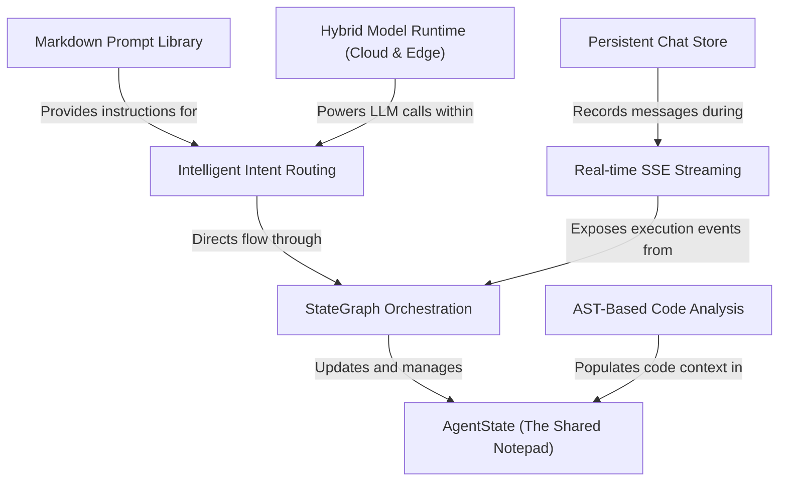

# Tutorial: backend

This backend serves as an **intelligent DevOps assistant** that simplifies complex tasks like *containerization*, *testing*, and *security auditing*. By combining **AST-based code scanning** with a **modular AI workflow**, the system can understand a project's architecture and provide expert guidance through a **real-time streaming** interface. It provides high flexibility by allowing users to switch between **Cloud and local Edge AI models** while ensuring all interactions are **persistently stored** for context-aware conversations.

**Source Repository:** [None](None)

## Chapters

1. [AST-Based Code Analysis
](01_ast_based_code_analysis_.md)
2. [AgentState (The Shared Notepad)
](02_agentstate__the_shared_notepad__.md)
3. [Intelligent Intent Routing
](03_intelligent_intent_routing_.md)
4. [StateGraph Orchestration
](04_stategraph_orchestration_.md)
5. [Markdown Prompt Library
](05_markdown_prompt_library_.md)
6. [Hybrid Model Runtime (Cloud & Edge)
](06_hybrid_model_runtime__cloud___edge__.md)
7. [Real-time SSE Streaming
](07_real_time_sse_streaming_.md)
8. [Persistent Chat Store
](08_persistent_chat_store_.md)

---

Generated by [AI Codebase Knowledge Builder](https://github.com/The-Pocket/Tutorial-Codebase-Knowledge)