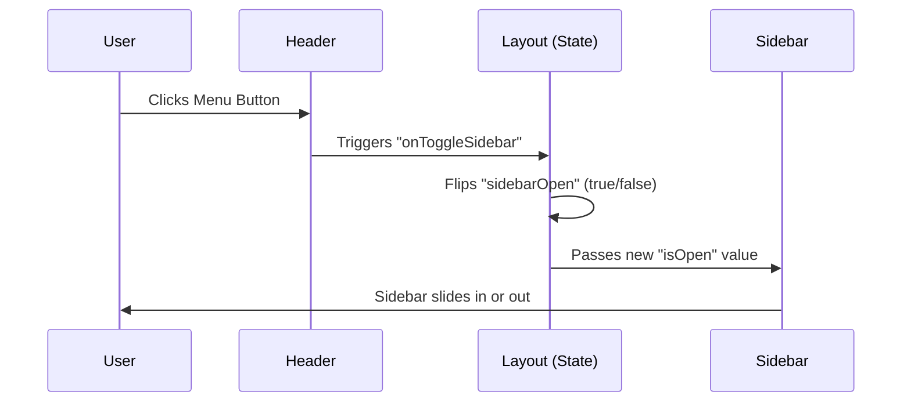

# Chapter 1: The App Shell (Layout System)

Welcome to the first step of building your DevOps Copilot! Before we build the "brain" of our AI chat, we need to build its "body." In web development, we call this the **App Shell**.

### The Motivation: Why an App Shell?

Imagine you are driving a car. As you drive through different cities, the scenery outside changes, but the steering wheel, the dashboard, and your seat stay exactly where they are. 

If the dashboard vanished and reappeared every time you turned a corner, you’d be confused and frustrated! 

In our application, the **App Shell** is that car chassis. It provides a consistent "home" for our users. Whether they are looking at an old conversation or starting a new one, the sidebar and header stay put. This solves two major problems:
1.  **Consistency:** Users always know where the "New Chat" button is.
2.  **Performance:** We don't have to re-render the entire screen—only the middle part (the chat) changes.

---

### Key Concepts of the Shell

The Layout System is broken down into four main parts:

1.  **The Wrapper (Layout):** The "boss" that coordinates where the sidebar and header go.
2.  **The Sidebar:** A sliding drawer that holds your history of conversations.
3.  **The Header:** The top bar showing the app name and settings.
4.  **The Main Stage (Content):** The empty space in the middle where the actual chat happens.

---

### How to Use the Layout

To use the shell, we simply wrap our chat components inside the `Layout` component. It looks like this:

```tsx
// Using the Layout in our main App
<Layout 
  conversations={myChatHistory}
  isBackendReady={true}
>
  {/* Everything inside here is the "Main Content" */}
  <ChatWindow /> 
</Layout>
```
*Output: You will see a sidebar on the left, a header at the top, and your Chat Window perfectly centered in the remaining space.*

---

### Under the Hood: How it Works

When a user interacts with the shell (like clicking the "Menu" button), a simple chain reaction occurs.



#### 1. The Coordinator (Layout.tsx)
The `Layout` component uses a "State" (a memory) to remember if the sidebar is open or closed.

```tsx
export default function Layout({ children, ...props }) {
  // A simple switch: true = open, false = closed
  const [sidebarOpen, setSidebarOpen] = useState(true);

  return (
    <div className="h-screen flex overflow-hidden gap-2">
      <Sidebar isOpen={sidebarOpen} onClose={() => setSidebarOpen(false)} {...props} />
      <div className="flex-1 flex flex-col">
        <Header onToggleSidebar={() => setSidebarOpen(!sidebarOpen)} />
        <main>{children}</main>
      </div>
    </div>
  );
}
```
*Note: `flex-1` tells the main area to "take up all the remaining space" left over by the sidebar.*

#### 2. The Sliding Drawer (Sidebar.tsx)
The sidebar uses the `isOpen` information to decide whether to hide itself off-screen.

```tsx
export default function Sidebar({ isOpen, onClose, conversations }) {
  return (
    <aside className={`fixed lg:relative z-50 transition-all 
      ${isOpen ? 'translate-x-0 w-72' : '-translate-x-full lg:w-0'}`}>
      {/* List of chats goes here */}
      <button onClick={onClose}>Close</button>
    </aside>
  );
}
```
*Analogy: This is like a pocket door. When `isOpen` is false, we slide it completely behind the "wall" (the edge of the screen).*

#### 3. The Appearance (ThemeToggle.tsx)
The shell also manages the "vibe" of the app. It can switch between Light and Dark modes.

```tsx
export default function ThemeToggle() {
  const [isDark, setIsDark] = useState(true);

  useEffect(() => {
    // This tells the browser: "Use the dark theme colors!"
    const theme = isDark ? 'dark' : 'light';
    document.documentElement.setAttribute('data-theme', theme);
  }, [isDark]);

  return <button onClick={() => setIsDark(!isDark)}>Toggle Theme</button>;
}
```

---

### Responsive Design: Mobile vs. Desktop
The App Shell is also "Smart." 
- On a **Desktop**, the sidebar usually stays visible next to the chat.
- On a **Mobile Phone**, the sidebar hides behind a hamburger menu so the chat has enough room to be readable.

We handle this using CSS classes like `lg:relative` (which means "on large screens, stay in the layout") and `fixed` (which means "on small screens, float on top of everything").

### Summary
In this chapter, we learned that:
- The **App Shell** is the structural foundation of our app.
- The **Layout** component coordinates the Sidebar, Header, and Main Content.
- We use **State** (`sidebarOpen`) to control animations and visibility.
- This setup ensures our app feels professional and consistent.

Now that we have a house to live in, it's time to build the "Brain" that manages our messages!

[Next Chapter: Chat State Orchestrator (useChat Hook)](02_chat_state_orchestrator__usechat_hook__.md)

---

Generated by [AI Codebase Knowledge Builder](https://github.com/The-Pocket/Tutorial-Codebase-Knowledge)