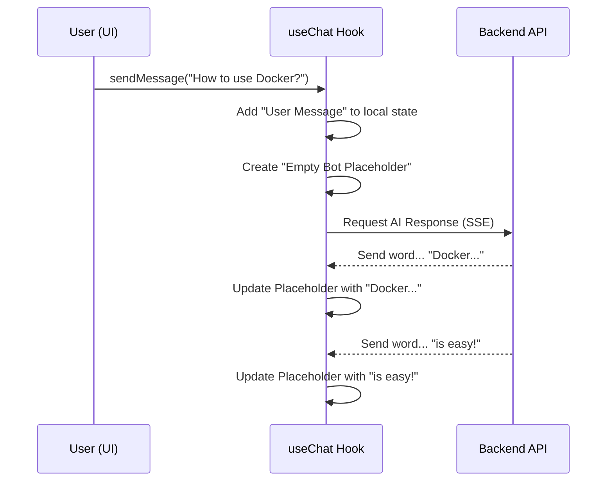

# Chapter 2: Chat State Orchestrator (useChat Hook)

In [Chapter 1: The App Shell (Layout System)](01_the_app_shell__layout_system__.md), we built the "body" of our application—the sidebar, the header, and the main container. But currently, that body is empty. It doesn't know how to talk, remember things, or react to your typing.

In this chapter, we are going to build the **Brain** of our DevOps Copilot: the `useChat` hook.

---

### The Motivation: Why a "Director"?

Imagine a movie set. You have actors (the messages), a stage (the UI), and a script (the backend data). Without a **Director**, the actors don't know when to enter, and the stage crew doesn't know when to change the scenery.

In our app, the `useChat` hook is that Director. It solves these problems:
1.  **Centralized Memory:** It keeps track of every message sent and received.
2.  **Simplified UI:** Your chat components don't need to know about complex API calls; they just say, "Hey Director, send this message!"
3.  **Real-time Updates:** It tells the UI exactly when the bot is "typing" or when a new chat has been created.

---

### Key Concepts of the Orchestrator

The Orchestrator manages three main things:

1.  **The Conversations:** A list of all the chats you've ever had.
2.  **The Active Chat:** The specific conversation you are looking at right now.
3.  **The Stream:** The "live" feeling of words appearing one-by-one as the AI thinks.

---

### How to Use the Hook

If you are building a chat window, you don't want to write 100 lines of code to handle messages. Instead, you just "plug in" the hook.

```tsx
// Inside your Chat Component
const { messages, sendMessage, isStreaming } = useChat();

return (
  <div>
    {messages.map(m => <p key={m.id}>{m.content}</p>)}
    {isStreaming && <span>The AI is thinking...</span>}
    <button onClick={() => sendMessage("Hello AI!")}>Send</button>
  </div>
);
```
*Output: This simple code allows a user to see messages, see a loading state, and trigger a message send with one click.*

---

### Under the Hood: The Message Flow

What happens when you click "Send"? It’s a carefully choreographed sequence of events:



#### 1. Setting up the "Memory"
The hook uses `useState` to remember the list of conversations and which one is currently selected.

```tsx
export function useChat() {
  const [conversations, setConversations] = useState([]);
  const [activeId, setActiveId] = useState(null);
  const [isStreaming, setIsStreaming] = useState(false);
  
  // This calculates the current messages automatically
  const activeChat = conversations.find(c => c.id === activeId);
  const messages = activeChat?.messages ?? [];
}
```
*Analogy: `conversations` is like a bookshelf, and `activeId` is the book you currently have open in your hands.*

#### 2. Creating the "User Message"
When you send a message, we immediately add it to the UI so the app feels fast. We don't wait for the server!

```tsx
const userMsg = { id: Date.now(), role: 'user', content: 'Hello!' };

// Add the message to the current conversation
setConversations(prev => prev.map(convo => 
  convo.id === activeId 
    ? { ...convo, messages: [...convo.messages, userMsg] }
    : convo
));
```
*Explanation: We search through our "bookshelf" for the right chat and append the new message to its list.*

#### 3. Handling the "Bot Response"
This is the magic part. Instead of waiting for the whole answer, we create an empty message and fill it bit-by-bit. This uses a technology called **SSE**, which we will dive deeper into in [Chapter 6: SSE Streaming Engine](06_sse_streaming_engine_.md).

```tsx
// 1. Create an empty assistant message
const botMsgId = "bot-123";
updateMessages(activeId, (msgs) => [...msgs, { id: botMsgId, content: "" }]);

// 2. As tokens arrive from the server:
onTokenReceived((text) => {
  updateMessages(activeId, (msgs) => 
    msgs.map(m => m.id === botMsgId ? { ...m, content: m.content + text } : m)
  );
});
```
*Analogy: It’s like a typewriter. Instead of waiting for the whole page to be finished, we show the user every single letter as it’s pressed.*

---

### Switching Conversations
The Orchestrator also handles moving between different chats. When you click a past conversation in the sidebar (built in [Chapter 1](01_the_app_shell__layout_system__.md)), the hook fetches the old messages from the database.

```tsx
const switchConversation = (id) => {
  setActiveId(id);
  // If we haven't loaded this chat's messages yet, go get them!
  if (!loadedIds.has(id)) {
    fetchMessagesFromServer(id).then(msgs => updateLocalStore(id, msgs));
  }
};
```
*Note: We cover how these messages are saved forever in [Chapter 5: Conversation Persistence (CRUD)](05_conversation_persistence__crud__.md).*

---

### Summary
In this chapter, we learned:
- The **`useChat` hook** is the central point of logic for our entire chat experience.
- It manages **State**, meaning it remembers your messages and whether the AI is currently talking.
- It **abstracts** the backend, making it easy for UI components to send messages without worrying about technical details.
- It handles **Streaming**, making the app feel alive by showing words as they are generated.

Now that we have a brain for our app, let's make the first-time experience better!

[Next Chapter: Interactive Welcome & Suggestion System](03_interactive_welcome___suggestion_system_.md)

---

Generated by [AI Codebase Knowledge Builder](https://github.com/The-Pocket/Tutorial-Codebase-Knowledge)