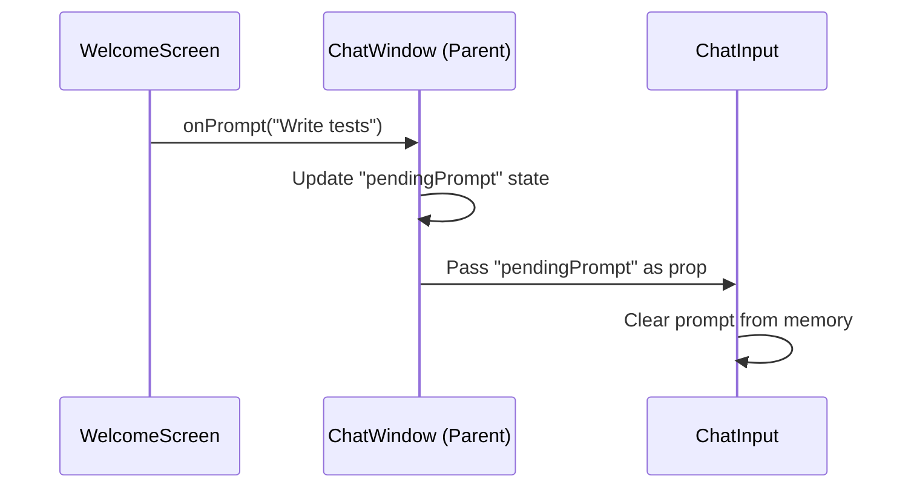

# Chapter 3: Interactive Welcome & Suggestion System

In [Chapter 2: Chat State Orchestrator (useChat Hook)](02_chat_state_orchestrator__usechat_hook__.md), we built the "brain" that manages messages and streaming. But if a user opens the app for the first time and sees an empty screen, they might not know what to say. 

In this chapter, we build the **Welcome Screen**—the friendly "face" of our app that helps users get started instantly.

---

### The Motivation: Solving "Blank Page Syndrome"

Imagine you walk into a high-tech kitchen. You want to cook, but you don't know what the machines do. If there is a menu on the wall that says "Press here for a 3-course Italian dinner," you’ll feel much more confident.

In DevOps, commands are often long and scary:
`docker build -t my-app . --label production`

Our system replaces that complexity with a simple button labeled **"Dockerfile."** 
1. **Low Friction:** No typing required to start.
2. **Education:** Users learn what the AI is capable of.
3. **Efficiency:** It pre-fills the input with an "optimized prompt" that gives the AI the best chance of success.

---

### Key Concepts

1. **The Suggestion Card:** A UI button containing a specific AI "instruction" (the prompt).
2. **Prompt Pre-filling:** A way to pass text from a button click into the chat input box automatically.
3. **Conditional Rendering:** Showing the welcome screen *only* when there are no messages to show.

---

### How to Use the Suggestion System

The user experience is seamless. When the user clicks a card, the text doesn't just disappear into the void; it jumps into the input box, ready to be sent.

```tsx
// Example: What happens when you click "Dockerfile"
const handleSuggestion = (prompt: string) => {
  // 1. Capture the prompt: "Generate an optimized Dockerfile..."
  // 2. Put it into the input box automatically
  setPendingPrompt(prompt);
};
```
*Output: The cursor blinks in the input bar, and the text is already there, waiting for the user to hit Enter.*

---

### Under the Hood: The Hand-off

How does a click on the **Welcome Screen** reach the **Chat Input**? They are separate components, so they need a "middleman" (the Chat Window).



#### 1. Defining the Suggestions (WelcomeScreen.tsx)
We store our "menu items" as an array of objects. Each has an icon, a label, and the secret "optimized prompt."

```tsx
const SUGGESTIONS = [
  {
    label: 'Dockerfile',
    prompt: 'Generate an optimized Dockerfile for this project',
    icon: FileCode2
  },
  // ... more items
];
```
*Analogy: This is like a deck of cards. Each card has a picture on the front and an instruction on the back.*

#### 2. The Trigger (WelcomeScreen.tsx)
When a user clicks a button, we call a function passed down from the parent.

```tsx
{SUGGESTIONS.map((s) => (
  <button onClick={() => onPrompt(s.prompt)}>
    <s.icon />
    <span>{s.label}</span>
  </button>
))}
```
*Explanation: We loop through our cards and create a button for each. Clicking it sends the "prompt" back up to the boss.*

#### 3. The Middleman (ChatWindow.tsx)
The `ChatWindow` holds the "pending prompt" in its memory.

```tsx
const [pendingPrompt, setPendingPrompt] = useState<string | undefined>();

const handleWelcomePrompt = (prompt: string) => {
  setPendingPrompt(prompt); // Save the text temporarily
};
```
*Note: We store this here because `ChatWindow` is the parent of both the Welcome Screen and the Input Bar.*

#### 4. The Hand-off (ChatInput.tsx)
Finally, the `ChatInput` notices there is a new `initialPrompt` and puts it into the text box.

```tsx
useEffect(() => {
  if (initialPrompt) {
    setInputValue(initialPrompt); // Put text in the box
    onConsumePrompt(); // Tell the parent "I got it, you can clear your memory"
  }
}, [initialPrompt]);
```
*Analogy: This is like a relay race. The Welcome Screen passes the baton (the prompt) to the Parent, who hands it to the Input Bar to finish the race.*

---

### Visual Polish: Neo-brutalism
You might notice in the code (e.g., `neo-btn`, `shadow-[6px_6px_0_...]`) that we use a specific style. This is called **Neo-brutalism**. It uses thick borders and hard shadows to make the UI feel "physical" and "engineered," which fits the DevOps theme perfectly.

---

### Summary
In this chapter, we learned:
- How to prevent **"Blank Page Syndrome"** by providing suggestions.
- How to **map complex commands** to simple, clickable UI cards.
- How to **transfer state** from one component to another using a parent "middleman."
- How to use `useEffect` to react when a suggestion is picked.

Now that our users can easily start a conversation, we need to make sure the right "specialist" answers their request!

[Next Chapter: Specialized Agent Routing](04_specialized_agent_routing_.md)

---

Generated by [AI Codebase Knowledge Builder](https://github.com/The-Pocket/Tutorial-Codebase-Knowledge)