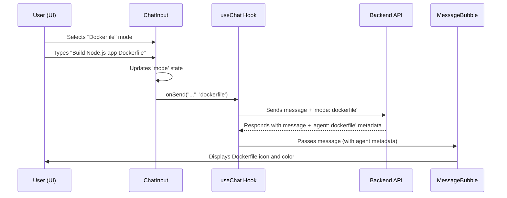

# Chapter 4: Specialized Agent Routing

In [Chapter 3: Interactive Welcome & Suggestion System](03_interactive_welcome___suggestion_system_.md), we made it easy for users to start a conversation with pre-written prompts. But what if our AI chatbot isn't a "one-size-fits-all" expert? What if it needs to handle highly specific DevOps tasks, like writing Dockerfiles or analyzing bundle sizes?

This chapter introduces **Specialized Agent Routing** – our way of making the chatbot a team of expert consultants, each good at a specific job.

---

### The Motivation: Your Own DevOps Dream Team

Imagine you're building a house. You don't ask the general contractor to also do the plumbing, wiring, and interior design all by themselves. You hire a plumber for pipes, an electrician for wires, and an interior designer for aesthetics. Each is a specialist.

Our DevOps Copilot works the same way. When you ask about:
*   **Dockerfiles:** You want an expert who knows all about containerization.
*   **Test Cases:** You need someone who understands testing frameworks.
*   **Production Readiness:** You require a specialist in deployment and monitoring.

Specialized Agent Routing solves this by:
1.  **Directing Questions:** Ensuring your question goes to the most qualified "agent" (specialist AI logic).
2.  **Tailored Experience:** Providing visual cues (like a specific icon and color) in the UI, so you instantly know *which* expert is responding.
3.  **Better Answers:** The backend can trigger highly optimized AI models or tools for the chosen specialization, leading to more accurate and helpful responses.

---

### Key Concepts

1.  **Agent Modes:** These are predefined categories of expertise, like "Dockerfile" or "Test Cases." Think of them as job titles for our AI consultants.
2.  **The Routing Desk:** This is the part of the system (mostly in the backend, but triggered by our frontend choice) that picks the right agent based on your request or selected mode.
3.  **UI Feedback:** Once an agent responds, the UI changes the bot's icon, color, and sometimes even shows specific progress steps to reflect that a specialist is at work.

---

### How to Use the Specialized Agent

Let's say you want to generate a Dockerfile. Instead of just typing "Generate a Dockerfile," you can tell the system, "Hey, I need the Dockerfile specialist!"

In our `ChatInput` component, you'll see a dropdown menu that lets you select an "Agent Mode."

```tsx
// Inside your ChatInput component
// ...
// User selects 'dockerfile' from the dropdown
const [mode, setMode] = useState<AgentMode>('auto'); 

const handleSubmit = () => {
  // When you send a message, the selected 'mode' goes with it
  onSend("Generate an optimized Dockerfile", "/path/to/project", mode, "cloud");
  setMessage('');
};
// ...
```
*Output: The system now knows you specifically want the "Dockerfile" agent to handle your request, ensuring the backend triggers the correct logic for building Dockerfiles.*

---

### Under the Hood: The Specialist Workflow

How does selecting an `AgentMode` in the UI lead to a specialized response with unique visual feedback? It's a clear chain of communication:



#### 1. Selecting the Specialist (`ChatInput.tsx`)

The `ChatInput` component holds the current `AgentMode` in its state. It uses a `<select>` HTML element to allow users to choose from a list of predefined modes.

```tsx
// src/components/chat/ChatInput.tsx (simplified)
import { useState } from 'react';
import type { AgentMode } from '../../types/chat'; // AgentMode type

const MODE_OPTIONS: Array<{ value: AgentMode; label: string }> = [
  { value: 'auto', label: 'Auto' },
  { value: 'dockerfile', label: 'Dockerfile' },
  { value: 'testcase', label: 'Test Cases' },
  // ... more agent modes
];

export default function ChatInput({ onSend, isStreaming, ...props }) {
  const [message, setMessage] = useState('');
  const [mode, setMode] = useState<AgentMode>('auto'); // State for the selected mode

  const handleSubmit = () => {
    // When sending, we pass the currently selected 'mode'
    onSend(message.trim(), '', mode, 'cloud');
    setMessage('');
  };

  return (
    <div>
      <select
        value={mode} // Display the current mode
        onChange={(e) => setMode(e.target.value as AgentMode)} // Update mode when changed
        disabled={isStreaming}
      >
        {MODE_OPTIONS.map((option) => (
          <option key={option.value} value={option.value}>
            {option.label}
          </option>
        ))}
      </select>
      <textarea value={message} onChange={(e) => setMessage(e.target.value)} />
      <button onClick={handleSubmit} disabled={!message.trim() || isStreaming}>
        Send
      </button>
    </div>
  );
}
```
*Explanation: The `<select>` dropdown allows the user to pick an `AgentMode`. When the user types a message and clicks 'Send', the `handleSubmit` function calls the `onSend` prop (which is provided by the [Chat State Orchestrator (useChat Hook)](02_chat_state_orchestrator__usechat_hook__.md)), passing the selected `mode` along with the message.*

#### 2. The Agent's Response Metadata (`types/chat.ts`)

The `useChat` hook sends this `mode` to the backend. The backend processes the request using its specialized logic and then sends back a message. Crucially, this message includes an `agent` property, telling the frontend *which* specialist handled the request.

```typescript
// src/types/chat.ts (simplified)
export type AgentMode = 'auto' | 'general' | 'dockerfile' | 'testcase' | 'bundlesize' | 'production';
// ...
export interface Message {
  id: string;
  role: 'user' | 'assistant';
  content: string;
  // This is the mode selected by the user to send to the backend
  mode?: AgentMode; 
  // This is the agent ID sent back by the backend, reflecting who responded
  agent?: string; 
  // ... other properties
}
```
*Explanation: The `Message` interface now has an `agent` field. When the backend sends a response, it sets this `agent` field (e.g., to `'dockerfile'`) so the frontend knows how to display it.*

#### 3. Displaying the Specialist's ID Card (`MessageBubble.tsx`)

Finally, the `MessageBubble` component (which renders each individual message) inspects the `agent` property of the incoming message. It uses this information to determine the correct icon, color, and label for the bot's response bubble.

```tsx
// src/components/chat/MessageBubble.tsx (simplified)
import { Bot, FileCode2, TestTube, Package, ShieldCheck } from 'lucide-react';
import type { Message } from '../../types/chat';

// A map to store meta-information for each agent
const AGENT_META: Record<string, { icon: typeof Bot; color: string; label: string }> = {
  general: { icon: Bot, color: 'bg-[var(--neo-primary)]', label: 'General DevOps Assistant' },
  dockerfile: { icon: FileCode2, color: 'bg-sky-600', label: 'Dockerfile Agent' },
  testcase: { icon: TestTube, color: 'bg-fuchsia-600', label: 'Test Case Agent' },
  // ... more agent definitions
};

export default function MessageBubble({ message }: MessageBubbleProps) {
  const isUser = message.role === 'user';
  // Look up agent info based on message.agent (e.g., 'dockerfile')
  const agentInfo = message.agent ? AGENT_META[message.agent] : null;
  const AgentIcon = agentInfo?.icon ?? Bot; // Use specific icon or default Bot icon

  return (
    <div className={`flex gap-3 ... ${isUser ? 'justify-end' : ''}`}>
      {!isUser && ( // Only for assistant messages
        <div
          className={`size-8 shrink-0 flex items-center justify-center border-2 rounded-[4px] ...
            ${agentInfo ? `${agentInfo.color}` : 'bg-[var(--neo-primary)]'}`} {/* Apply agent color */}
        >
          <AgentIcon className="size-4 text-white" /> {/* Display agent-specific icon */}
        </div>
      )}
      <div className={`max-w-[min(92%,78ch)] ...`}>
        {!isUser && agentInfo && !message.isStreaming && (
          <div className="flex items-center gap-1.5 mb-2">
            <span className={`inline-flex h-5 px-2 ... ${agentInfo.color}`}>
              {agentInfo.label} {/* Display agent label (e.g., "Dockerfile Agent") */}
            </span>
          </div>
        )}
        {/* ... Message content and other details ... */}
      </div>
      {isUser && (/* User icon here */)}
    </div>
  );
}
```
*Analogy: This `AGENT_META` is like a directory of business cards. When a message comes in, `MessageBubble` looks at the `agent` field, finds the corresponding business card, and uses the icon and color from it to customize the display.*

---

### Summary

In this chapter, we learned:
- Our chatbot isn't just one general AI; it's a **firm of specialized consultants**.
- **Agent Modes** (like `dockerfile`, `testcase`) allow users to direct their questions to the right specialist.
- The UI (specifically `ChatInput`) sends the chosen `mode` to the backend.
- The backend responds with an `agent` identifier, which the UI (`MessageBubble`) uses to show **tailored visual feedback** (icons, colors, labels) for each specialist.

Now that our messages are being expertly routed, we need a way to remember all these great conversations!

[Next Chapter: Conversation Persistence (CRUD)](05_conversation_persistence__crud__.md)

---

Generated by [AI Codebase Knowledge Builder](https://github.com/The-Pocket/Tutorial-Codebase-Knowledge)