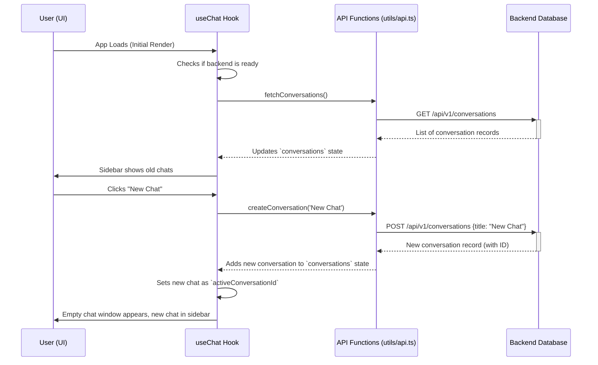

# Chapter 5: Conversation Persistence (CRUD)

In [Chapter 4: Specialized Agent Routing](04_specialized_agent_routing_.md), we made sure our chatbot could direct questions to the right expert and show unique visual feedback. But what if you close your browser tab or your computer crashes? All those brilliant Dockerfile generations and insightful test cases would be gone forever!

This chapter is about **Conversation Persistence (CRUD)** – the "memory" of our application. It's how your DevOps Copilot remembers every chat you've ever had, even if you refresh your page or come back days later.

---

### The Motivation: A Digital Filing Cabinet

Imagine your work desk. You might have several ongoing projects, each with its own folder of notes and documents. If you just scattered all your papers across the desk, it would be a mess, and you'd quickly lose track of what belongs to which project.

Our application needs a similar system. Each conversation is like a project folder. When you generate a new Dockerfile, you want to be able to find it again later.
Conversation Persistence solves these problems:
1.  **Memory Across Sessions:** Your chats don't disappear when you refresh or close the app.
2.  **Organized History:** You can see a list of all your past conversations (in the [App Shell's Sidebar](01_the_app_shell__layout_system__.md)).
3.  **Editable Records:** You can rename a chat or even delete old, unwanted ones.
4.  **Resilience:** Even if the central database is temporarily down, the app tries its best to keep working and save your new chats locally until the connection is restored.

---

### Key Concepts: CRUD (Create, Read, Update, Delete)

Persistence is all about managing data, which we often describe using the acronym **CRUD**:

1.  **Create:** Starting a brand-new conversation.
2.  **Read:** Loading your list of old conversations or fetching all messages within a specific chat.
3.  **Update:** Changing something about a conversation, like its title.
4.  **Delete:** Removing an old conversation you no longer need.

Think of it like managing files on your computer:
-   **Create:** Saving a new document.
-   **Read:** Opening an existing document.
-   **Update:** Editing and saving changes to a document.
-   **Delete:** Moving a document to the trash.

---

### How to Use Conversation Persistence

As a user, you mostly interact with persistence through the UI:
-   Clicking "New Chat" in the sidebar.
-   Seeing your list of past conversations on the left.
-   Clicking an old conversation to view its history.
-   When the first message is sent, the chat gets a smart title.
-   Deleting a conversation from the sidebar.

Behind the scenes, the [`useChat` hook](02_chat_state_orchestrator__usechat_hook__.md) is doing all the heavy lifting, calling specialized functions to talk to our backend API.

```tsx
// Simplified example of how useChat methods handle persistence
const {
  conversations,       // Read: List of all chats for the sidebar
  activeConversation,  // Read: The current chat's messages
  newChat,             // Create: Starts a new empty chat
  switchConversation,  // Read: Loads messages for a specific chat
  deleteConversation,  // Delete: Removes a chat from history
  sendMessage          // Create/Update: Creates chat if none, updates title, saves messages
} = useChat();

return (
  <Layout conversations={conversations}> {/* Sidebar needs `conversations` */}
    {/* ... UI elements ... */}
    <button onClick={newChat}>Start a New Chat</button>
    {conversations.map(convo => (
      <button key={convo.id} onClick={() => switchConversation(convo.id)}>
        {convo.title}
      </button>
    ))}
  </Layout>
);
```
*Output: This code provides the list of conversations needed by the `Layout` (from [Chapter 1](01_the_app_shell__layout_system__.md)) and allows users to interact with their chat history.*

---

### Under the Hood: The Persistence Workflow

Let's trace what happens when you open the app and then start a new chat.



#### 1. Talking to the Backend (`src/utils/api.ts`)

Our application has a dedicated set of functions that know how to talk to the backend's database API. These functions are found in `src/utils/api.ts`. They handle sending requests (like "get all conversations") and receiving responses.

```typescript
// src/utils/api.ts (simplified)

// 1. Create a new conversation
export async function createConversation(title = 'New Chat'): Promise<ConversationRecord> {
  const response = await fetch(`${API_BASE}/api/v1/conversations`, {
    method: 'POST',
    body: JSON.stringify({ title }),
  });
  // ... error handling ...
  return (await response.json()) as ConversationRecord;
}

// 2. Fetch all conversations
export async function fetchConversations(): Promise<ConversationRecord[]> {
  const response = await fetchWithRetry(`${API_BASE}/api/v1/conversations`, { method: 'GET' });
  // ... error handling ...
  return (await response.json()) as ConversationRecord[];
}

// 3. Fetch messages for a specific conversation
export async function fetchConversationMessages(
  conversationId: string,
): Promise<StoredMessageRecord[]> {
  const response = await fetchWithRetry(
    `${API_BASE}/api/v1/conversations/${conversationId}/messages`,
    { method: 'GET' },
  );
  // ... error handling ...
  return (await response.json()) as StoredMessageRecord[];
}

// 4. Update a conversation's title
export async function updateConversationTitle(
  conversationId: string,
  title: string,
): Promise<ConversationRecord> {
  const response = await fetch(`${API_BASE}/api/v1/conversations/${conversationId}`, {
    method: 'PATCH',
    body: JSON.stringify({ title }),
  });
  // ... error handling ...
  return (await response.json()) as ConversationRecord;
}

// 5. Delete a conversation
export async function deleteConversationById(conversationId: string): Promise<void> {
  const response = await fetch(`${API_BASE}/api/v1/conversations/${conversationId}`, {
    method: 'DELETE',
  });
  // ... error handling ...
}
```
*Explanation: These `async` functions are like specialized postal workers. They know exactly how to package your requests (like "create a new chat") and send them to the right backend address. The `fetchWithRetry` function adds robustness, attempting the request multiple times if the network is flaky, which is important for a stable app.*

#### 2. Orchestrating with `useChat` (`src/hooks/useChat.ts`)

The [`useChat` hook](02_chat_state_orchestrator__usechat_hook__.md) is the central director. It decides *when* to call these API functions and *how* to update the application's memory (its `useState` variables) with the results.

**Loading Conversations:**
When the app first starts or the backend becomes ready, `useChat` fetches all existing conversations.

```tsx
// src/hooks/useChat.ts (simplified useEffect)
useEffect(() => {
  if (!isBackendReady || hasLoadedConversationListRef.current) return;

  setIsLoading(true);
  void fetchConversations() // Call the API to get all chats
    .then((items) => {
      const normalized = items.map(toConversation);
      setConversations(normalized); // Update the state with fetched chats
      if (normalized.length > 0) setActiveConversationId(normalized[0].id);
      hasLoadedConversationListRef.current = true;
    })
    .catch(() => {
      // Graceful fallback: UI remains usable even if backend fails.
    })
    .finally(() => {
      setIsLoading(false);
    });
}, [isBackendReady]);
```
*Explanation: This `useEffect` runs when the backend is ready. It calls `fetchConversations` (from `api.ts`), takes the list of chats, and updates the `conversations` state, which then displays them in the sidebar.*

**Creating a New Chat (and graceful fallback):**
When you click "New Chat," `useChat` tries to create it on the backend. If the backend isn't available, it creates a "local" chat with a temporary ID.

```tsx
// src/hooks/useChat.ts (simplified newChat function)
const newChat = useCallback(() => {
  void createConversation('New Chat') // Try to create on backend
    .then((record) => {
      const convo = toConversation(record);
      setConversations((prev) => [convo, ...prev]);
      setActiveConversationId(convo.id);
    })
    .catch(() => {
      // If backend fails, create a local fallback conversation
      const fallback: Conversation = {
        id: generateId(), // Uses a temporary local ID
        title: 'New Chat',
        messages: [],
        createdAt: new Date(),
        updatedAt: new Date(),
      };
      setConversations((prev) => [fallback, ...prev]);
      setActiveConversationId(fallback.id);
    });
}, []);
```
*Explanation: This is where our error handling shines! If `createConversation` fails (e.g., backend is unreachable), we don't just break. We create a `fallback` conversation with a `generateId()` (a temporary ID like `1701234567-abcdef`) directly in the frontend's memory. This means the user can still start chatting, even without a live backend connection. The app tries to recover later.*

**Deleting a Conversation:**
When a user deletes a chat, `useChat` tells the backend to remove it, but also immediately updates the UI for a fast experience.

```tsx
// src/hooks/useChat.ts (simplified deleteConversation function)
const deleteConversation = useCallback(
  (id: string) => {
    void deleteConversationById(id).catch(() => {
      // If backend delete fails, still keep it deleted locally
    });
    // Immediately remove from local state for snappy UI
    setConversations((prev) => prev.filter((c) => c.id !== id));
    // ... logic to switch active conversation if current one was deleted ...
  },
  [activeConversationId, conversations],
);
```
*Explanation: We call `deleteConversationById` to tell the backend to delete it. But crucially, we also `setConversations` to remove it from our local list *right away*. This makes the app feel responsive. If the backend fails to delete it, the user still sees it gone, and the app will try to sync later.*

---

### Summary

In this chapter, we learned:
-   **Conversation Persistence** is essential for our app to have a "memory" and provide a consistent user experience.
-   We manage conversations using **CRUD** operations: Create, Read, Update, and Delete.
-   The `src/utils/api.ts` file contains functions that communicate directly with the backend database.
-   The [`useChat` hook](02_chat_state_orchestrator__usechat_hook__.md) orchestrates these API calls and updates the app's internal state.
-   Our app includes **robust error handling** and **graceful fallbacks** (like using local IDs) so users can keep chatting even if the backend is temporarily unavailable.

Now that our app can remember conversations, it's time to make the bot's responses feel truly dynamic and real-time!

[Next Chapter: SSE Streaming Engine](06_sse_streaming_engine_.md)

---

Generated by [AI Codebase Knowledge Builder](https://github.com/The-Pocket/Tutorial-Codebase-Knowledge)