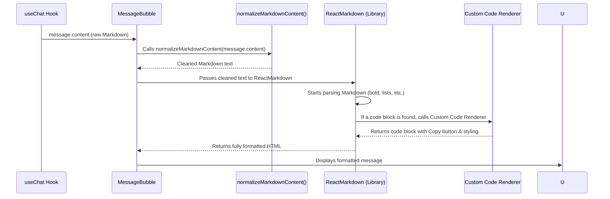

# Chapter 7: Intelligent Markdown Renderer

In [Chapter 6: SSE Streaming Engine](06_sse_streaming_engine_.md), we made our AI responses appear on screen in real-time, character by character. That's fantastic for responsiveness! But what if the AI sends back complex information like code, tables, or bold text? If we just show that raw text, it can look messy and be hard to read.

This chapter introduces the **Intelligent Markdown Renderer** – a special part of our app that takes the AI's "shorthand notes" and transforms them into beautifully formatted, easy-to-read content.

---

### The Motivation: Making Technical Text Readable

Imagine you receive an instruction manual that's just a long block of text with no paragraphs, headings, or bold words. Now imagine that manual also includes raw programming code mixed in. It would be nearly impossible to understand!

AI models often return technical data that uses a common shorthand called **Markdown**. For example, `**hello**` means "hello in bold," and `` ```python print("hi") ``` `` means "this is a Python code block."

Our Intelligent Markdown Renderer solves these problems:
1.  **Readability:** It turns raw Markdown (like `**bold**` or code blocks) into styled HTML that's easy on the eyes.
2.  **Functionality:** It goes beyond just styling. For code blocks, it automatically adds a "Copy" button and even highlights the code's syntax, making it super useful for developers.
3.  **Cleanliness:** AI streams can sometimes send unusual newline characters. This system "normalizes" those, ensuring our chat bubbles always look clean and professional.

---

### Key Concepts

1.  **Markdown:** A simple way to add formatting (like bold, italics, lists, code) to plain text. It's widely used for documentation.
2.  **Rendering:** The process of converting Markdown text into visible, styled HTML on your screen.
3.  **Intelligence:** Our renderer isn't just basic. It's "intelligent" because it:
    *   **Highlights Code:** Makes code blocks colorful and easy to read.
    *   **Adds Copy Buttons:** Puts a handy "Copy" button right above code blocks.
    *   **Normalizes Text:** Cleans up messy hidden characters that sometimes come from the AI.

---

### How to Use the Renderer

As a developer, you don't need to do much! The hard work is already done inside the `MessageBubble` component. When the AI sends its response, the `useChat` hook (from [Chapter 2: Chat State Orchestrator (useChat Hook)](02_chat_state_orchestrator__usechat_hook__.md)) stores it in `message.content`. The `MessageBubble` then takes this raw content and automatically renders it beautifully.

```tsx
// Inside your MessageBubble component (simplified)
export default function MessageBubble({ message }) {
  // 'message.content' might be raw markdown: "**Hello** world. ```js console.log('hi')```"
  const formattedContent = formatAndRender(message.content); // This is what our system does!

  return (
    <div className="chat-bubble">
      {/* The beautifully formatted content is displayed here */}
      {formattedContent}
    </div>
  );
}
```
*Output: If the `message.content` was `**Hello** world.`, the user would see **Hello** world. If it contained code, they'd see a highlighted code block with a "Copy" button.*

---

### Under the Hood: From Raw Text to Pretty Output

Let's see the journey of an AI's response from raw Markdown to a polished chat bubble.



Our `MessageBubble` component (`src/components/chat/MessageBubble.tsx`) is where all this intelligence lives.

#### 1. Cleaning Up Messy Newlines (`normalizeMarkdownContent`)

Sometimes, especially from streaming AI responses, newline characters (`\n`) can get "escaped" (turned into `\\n`) or become inconsistent (`\r\n`). This makes the Markdown renderer confused and can lead to strange formatting. Our `normalizeMarkdownContent` function fixes this.

```tsx
// src/components/chat/MessageBubble.tsx (simplified)
function normalizeMarkdownContent(content: string): string {
  if (!content) return '';

  // Step 1: Replace common Windows newlines with Unix style
  const normalizedNewlines = content.replace(/\r\n?/g, '\n');

  // Step 2: Check if newlines might be "double-escaped" like \\n
  const escapedNewlineCount = (normalizedNewlines.match(/\\n/g) ?? []).length;
  const realNewlineCount = (normalizedNewlines.match(/\n/g) ?? []).length;

  const shouldUnescape = escapedNewlineCount > realNewlineCount;

  if (shouldUnescape) {
    // If they are, unescape them!
    return normalizedNewlines
        .replace(/\\n/g, '\n') // Turn \\n into \n
        .replace(/\\t/g, '\t'); // And \\t into \t
  }

  return normalizedNewlines.trimEnd(); // Remove extra spaces at the end
}
```
*Explanation: This function first makes sure all newlines are consistent. Then, it cleverly checks if there are many `\\n` (double backslash n) characters. If there are, it's likely they are meant to be single newlines (`\n`) and correctly converts them. This ensures the Markdown parser gets clean input.*

#### 2. Bringing in the Markdown Power (`ReactMarkdown`)

We use a popular library called `react-markdown`. It takes our cleaned Markdown text and turns it into real HTML elements. We also add `remarkGfm` for extra features like tables, task lists, and strikethrough text.

```tsx
// src/components/chat/MessageBubble.tsx (simplified)
import ReactMarkdown from 'react-markdown';
import remarkGfm from 'remark-gfm';

// ... inside the MessageBubble component ...
const normalizedContent = useMemo(
  () => normalizeMarkdownContent(message.content ?? ''),
  [message.content],
);

return (
  <div className="chat-markdown">
    <ReactMarkdown
      remarkPlugins={[remarkGfm]} // Add support for GFM features (tables, etc.)
      components={{ /* ... custom renderers go here ... */ }}
    >
      {normalizedContent}
    </ReactMarkdown>
  </div>
);
```
*Explanation: `ReactMarkdown` is like a smart translator. It reads our `normalizedContent`, understands the Markdown syntax, and builds the right HTML elements to display it beautifully. `remarkGfm` extends its capabilities to handle more advanced Markdown features common in developer tools.*

#### 3. Supercharging Code Blocks (Custom `pre` Renderer)

This is where the "intelligent" part really shines! By default, `ReactMarkdown` would just put code inside `<pre><code>` tags. We tell it to use our *own* special component for code blocks (`pre`) so we can add extra features.

```tsx
// src/components/chat/MessageBubble.tsx (simplified - within ReactMarkdown `components` prop)
components={{
  pre({ children }) { // 'pre' is the HTML tag for pre-formatted text (like code)
    const codeText = String(children).trim(); // Get the raw code content

    // We can figure out the language (e.g., 'python', 'javascript')
    // from 'className' property that markdown provides (simplified here for brevity)
    const language = "text"; // Example, actual code extracts it dynamically

    const copyCodeBlock = async () => {
      // When the user clicks "Copy", put the code on their clipboard
      await navigator.clipboard.writeText(codeText);
    };

    return (
      <div className="chat-code-block">
        <div className="chat-code-block__header">
          <span className="chat-code-block__lang">{language}</span>
          <button onClick={copyCodeBlock} className="chat-code-block__copy">
            Copy
          </button>
        </div>
        <pre><code>{codeText}</code></pre> {/* Display the actual code */}
      </div>
    );
  },
}}
```
*Explanation: Whenever `ReactMarkdown` encounters a code block (like three backticks `), it calls our `pre` component. Inside our `pre` component, we extract the code, determine its language (for potential future syntax highlighting), and then render it with a custom header that includes a "Copy" button. Clicking this button copies the code directly to the user's clipboard.*

#### 4. Copy Entire Message

Beyond code blocks, we also provide a "Copy" button for the entire AI message. This is useful if the response is just plain text or a mix of formatting without specific code blocks.

```tsx
// src/components/chat/MessageBubble.tsx (simplified - for the whole message)
import { Copy, Check } from 'lucide-react'; // Icons

// ... inside MessageBubble ...
const [copied, setCopied] = useState(false);

useEffect(() => {
  if (!copied) return;
  const timeout = window.setTimeout(() => setCopied(false), 1200); // Reset after 1.2s
  return () => window.clearTimeout(timeout);
}, [copied]);

const copyMessage = async () => {
  await navigator.clipboard.writeText(normalizedContent);
  setCopied(true);
};

return (
  // ... other bubble content ...
  {!isUser && normalizedContent && ( // Only for AI messages with content
    <div className="mb-2 flex items-center justify-end">
      <button onClick={copyMessage} className="neo-btn">
        {copied ? <Check className="size-3" /> : <Copy className="size-3" />}
        {copied ? 'Copied' : 'Copy'}
      </button>
    </div>
  )}
  // ... rest of the message content ...
);
```
*Explanation: This button appears at the top right of assistant messages. When clicked, it copies the entire processed Markdown content to the clipboard and briefly changes its text to "Copied" before returning to "Copy." The `useEffect` makes sure the "Copied" status resets after a short delay.*

---

### Summary

In this chapter, we learned:
-   The **Intelligent Markdown Renderer** is crucial for making AI's technical output easy to read and interact with.
-   It uses a **normalization step** to clean up messy newline characters from AI streams.
-   The `react-markdown` library converts Markdown syntax into rich HTML.
-   We customize its behavior for **code blocks** to add a helpful "Copy" button and enable future syntax highlighting.
-   A general "Copy" button is also available for the entire AI message, improving user convenience.

Now that our AI responses look great, let's add some visual cues to show what the app is doing in the background!

[Next Chapter: Generation & Sync Status Indicators](08_generation___sync_status_indicators_.md)

---

Generated by [AI Codebase Knowledge Builder](https://github.com/The-Pocket/Tutorial-Codebase-Knowledge)