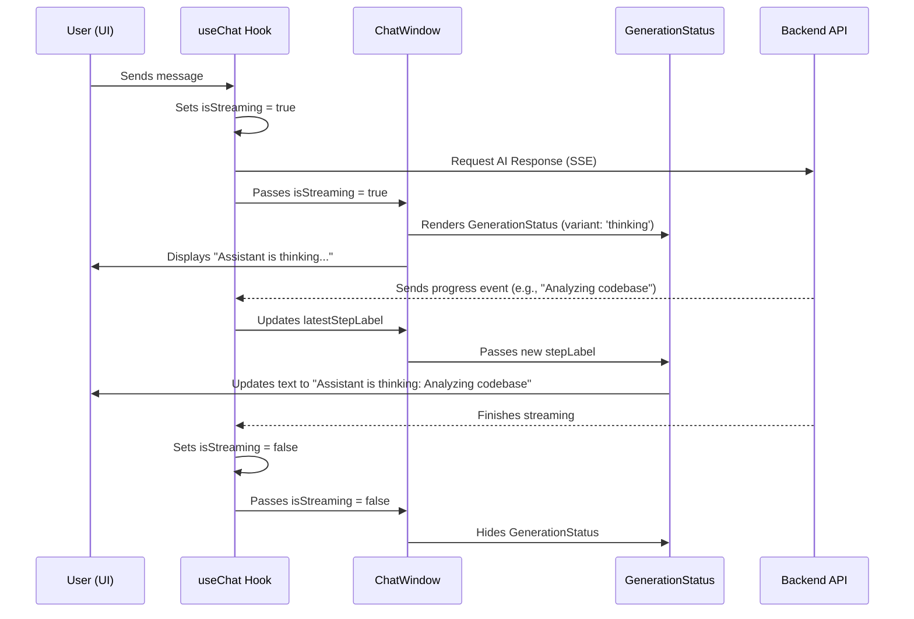

# Chapter 8: Generation & Sync Status Indicators

In [Chapter 7: Intelligent Markdown Renderer](07_intelligent_markdown_renderer_.md), we made our AI's responses look beautiful and readable. But even the prettiest text won't help if the user is left staring at a blank screen, wondering if the app is working! AI tasks, like generating code, and backend operations, like fetching past conversations, can take time.

This chapter introduces **Generation & Sync Status Indicators** – the "waiters" of our app, who politely tell you what's happening behind the scenes, so you never feel left in the dark.

---

### The Motivation: Preventing "Is It Broken?" Moments

Imagine you're at a restaurant, and you've ordered a complex dish. If the waiter takes your order and then disappears for 20 minutes without a word, you might start to worry: "Did they forget my order? Is the chef even cooking?"

Our DevOps Copilot faces a similar challenge. When you ask the AI to "Generate an optimized Dockerfile" or when the app loads your entire conversation history, these aren't instant operations. If the app just freezes or shows nothing, you might think it's crashed.

Our status indicators solve this by:
1.  **Keeping You Informed:** They provide real-time updates on what the AI or the backend is currently doing (e.g., "Analyzing codebase," "Syncing history").
2.  **Reducing Perceived Latency:** Even if an operation takes time, seeing progress or a "thinking" animation makes the wait feel shorter and less frustrating.
3.  **Building Trust:** The app feels more robust and reliable when it openly communicates its internal state.

---

### Key Concepts

1.  **`GenerationStatus` Component:** This is our main "waiter" component. It displays animated bars and text labels to show activity.
2.  **Thinking vs. Syncing:** We differentiate between two main types of delays:
    *   **"Thinking" (Generation):** When the AI is actively generating a response.
    *   **"Sync" (Loading/Fetching):** When the app is loading data from the backend, like your chat history.
3.  **Dynamic Labels (`stepLabel`):** The AI can provide specific progress updates (e.g., "Analyzing codebase," "Building response") which are shown to the user.
4.  **`isStreaming` & `isLoading`:** These are signals from the [Chat State Orchestrator (useChat Hook)](02_chat_state_orchestrator__usechat_hook__.md) that tell our UI when to show an indicator.

---

### How to Use the Status Indicators

As a developer, you primarily interact with the `GenerationStatus` component through the `ChatWindow`. The `ChatWindow` looks at the state provided by the [`useChat` hook](02_chat_state_orchestrator__usechat_hook__.md) (specifically `isStreaming` and `isLoading`) and decides when to show the status indicator.

You just need to pass the right information to the `GenerationStatus` component:

```tsx
// Inside your ChatWindow component (simplified)
import GenerationStatus from './GenerationStatus';
// ... other imports and props ...

export default function ChatWindow({ messages, isStreaming, isLoading, ...props }) {
  // ... (logic to determine showGenerationStatus and latestStepLabel) ...

  return (
    <div className="flex flex-col h-full">
      {/* ... Messages area ... */}
      <div className="flex-1 overflow-y-auto">
        {/* ... existing messages ... */}

        {/* 1. Show when AI is actively streaming a response */}
        {showGenerationStatus && <GenerationStatus stepLabel={latestStepLabel} />}

        {/* 2. Show when the app is loading chat context (not streaming AI) */}
        {!showGenerationStatus && isLoading && !isStreaming && (
          <GenerationStatus stepLabel="Syncing conversation state..." variant="sync" />
        )}
      </div>
      {/* ... Input bar ... */}
    </div>
  );
}
```
*Output: When the AI is thinking, you'll see animated bars and text like "Assistant is thinking: Analyzing codebase." When the app is fetching history, you'll see a different animation and "Loading chat context: Preparing conversations."*

---

### Under the Hood: The Information Flow

Let's trace how the app decides to show you a status update, from sending a message to seeing the "thinking" indicator.



#### 1. Deciding When to Show (`src/components/chat/ChatWindow.tsx`)

The `ChatWindow` component is the main parent that orchestrates the display. It receives `messages`, `isStreaming`, and `isLoading` as props from the [`useChat` hook](02_chat_state_orchestrator__usechat_hook__.md). It uses these to figure out when to render `GenerationStatus`.

```tsx
// src/components/chat/ChatWindow.tsx (simplified relevant logic)
// ...
export default function ChatWindow({ messages, isStreaming, isLoading, ...props }) {
  // ... other state and refs ...

  // Find the latest assistant message that is currently streaming (if any)
  const latestAssistant = [...messages]
    .reverse()
    .find((msg) => msg.role === 'assistant' && msg.isStreaming);

  // Decide if we should show the "thinking" status for AI generation
  const showGenerationStatus =
    isStreaming && // Is the AI actively streaming?
    !!latestAssistant && // Is there an active streaming message?
    latestAssistant.content.trim().length === 0; // Is the message empty (so we show status instead of partial text)?

  // Get the specific step label from the streaming message (e.g., "Analyzing codebase")
  const latestStepLabel = latestAssistant?.progressSteps?.at(-1)?.label;

  return (
    <div className="flex flex-col h-full w-full">
      <div className="flex-1 overflow-y-auto">
        {/* ... existing messages ... */}

        {/* This condition shows the AI thinking status */}
        {showGenerationStatus && <GenerationStatus stepLabel={latestStepLabel} />}

        {/* This condition shows the 'syncing' status when loading, but not actively streaming */}
        {!showGenerationStatus && isLoading && !isStreaming && (
          <GenerationStatus stepLabel="Syncing conversation state..." variant="sync" />
        )}
      </div>
      {/* ... input bar ... */}
    </div>
  );
}
```
*Explanation: The `ChatWindow` first finds if there's an AI message currently being streamed. If the AI is streaming (`isStreaming` is true) and its message content is still empty (meaning no words have appeared yet), it shows the `GenerationStatus` with the `latestStepLabel`. If the app is generally loading (`isLoading` is true) but not actively streaming AI responses, it shows a "sync" variant, indicating it's fetching data.*

#### 2. The `GenerationStatus` Component (`src/components/chat/GenerationStatus.tsx`)

This component is purely presentational. It takes the `stepLabel` and `variant` props and renders the appropriate text and animated bars.

```tsx
// src/components/chat/GenerationStatus.tsx
interface GenerationStatusProps {
  stepLabel?: string; // The specific action, e.g., "Analyzing codebase"
  variant?: 'thinking' | 'sync'; // Whether it's AI generation or backend sync
}

export default function GenerationStatus({
  stepLabel,
  variant = 'thinking', // Default to 'thinking' if not specified
}: GenerationStatusProps) {
  // Set the main title based on the variant
  const title = variant === 'sync' ? 'Loading chat context' : 'Assistant is thinking';
  // Set the subtitle, using stepLabel if available, otherwise a default
  const subtitle = stepLabel || (variant === 'sync' ? 'Preparing conversations' : 'Building response');

  return (
    <div className="generation-status animate-message-in mt-2" role="status" aria-live="polite">
      {/* Animated bars - these are styled with CSS to move */}
      <div className="generation-status__bars" aria-hidden="true">
        <span /> <span /> <span /> <span />
      </div>
      {/* Text content */}
      <div className="min-w-0">
        <p className="generation-status__title">{title}</p>
        <p className="generation-status__subtitle truncate">{subtitle}</p>
      </div>
      {/* A small tag indicating the type of status */}
      <span className="generation-status__tag">{variant === 'sync' ? 'Sync' : 'Live'}</span>
    </div>
  );
}
```
*Explanation: This component receives the `stepLabel` (which describes the AI's current action) and a `variant` (either 'thinking' for AI or 'sync' for backend loading). It then uses these props to display the correct main title, a more specific subtitle (using `stepLabel` if provided), and a small 'Sync' or 'Live' tag. The `generation-status__bars` are just simple `<span>` elements that are given an animation effect using CSS.*

---

### Summary

In this chapter, we learned:
-   **Generation & Sync Status Indicators** are crucial for making our app feel responsive and reliable, especially during AI computations or backend data fetches.
-   The `GenerationStatus` component acts as our app's "waiter," providing visual feedback.
-   We distinguish between **"thinking" (AI generation)** and **"sync" (backend loading)** states using the `variant` prop.
-   The `ChatWindow` component uses `isStreaming` and `isLoading` from the [`useChat` hook](02_chat_state_orchestrator__usechat_hook__.md) to decide when to display the appropriate status indicator.
-   Dynamic `stepLabel` updates further enhance the user experience by describing specific ongoing tasks.

This concludes our tutorial on building the `frontend` of your DevOps Copilot! You now have a comprehensive understanding of its core components, from the initial layout to intelligent rendering and user feedback.

---

Generated by [AI Codebase Knowledge Builder](https://github.com/The-Pocket/Tutorial-Codebase-Knowledge)