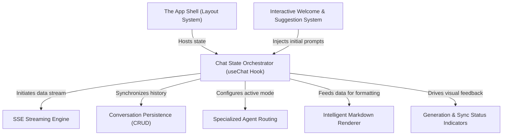
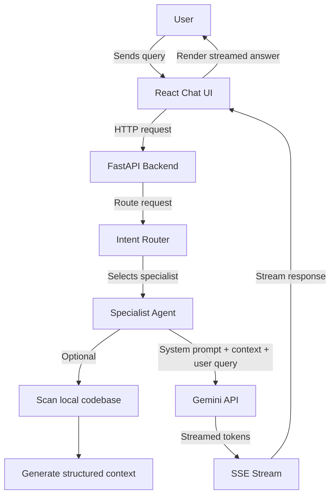
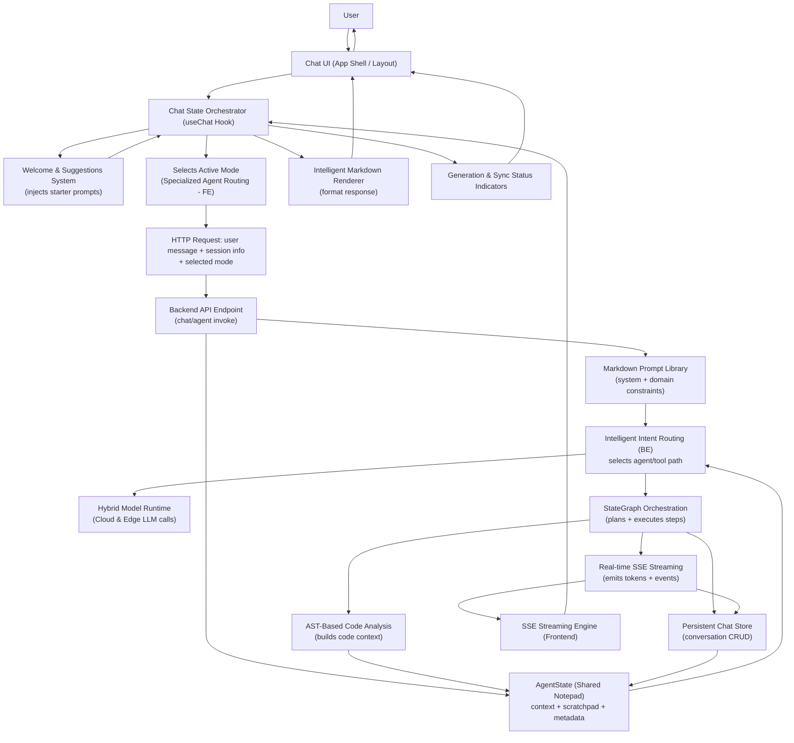

# Tutorial: frontend

The **DevOps Copilot** is a specialized AI chat interface designed to streamline *infrastructure management* and *deployment* tasks. It features a suite of **specialized agents**—such as experts for Dockerfiles and Production Readiness—that provide real-time, *streamed responses* to user queries. The application balances a retro-modern UI with robust **conversation persistence**, ensuring that technical DevOps workflows are both interactive and easily retrievable.

**Source Repository:** [None](None)

## Chapters

1. [The App Shell (Layout System)
](01_the_app_shell__layout_system__.md)
2. [Chat State Orchestrator (useChat Hook)
](02_chat_state_orchestrator__usechat_hook__.md)
3. [Interactive Welcome & Suggestion System
](03_interactive_welcome___suggestion_system_.md)
4. [Specialized Agent Routing
](04_specialized_agent_routing_.md)
5. [Conversation Persistence (CRUD)
](05_conversation_persistence__crud__.md)
6. [SSE Streaming Engine
](06_sse_streaming_engine_.md)
7. [Intelligent Markdown Renderer
](07_intelligent_markdown_renderer_.md)
8. [Generation & Sync Status Indicators
](08_generation___sync_status_indicators_.md)

---

Generated by [AI Codebase Knowledge Builder](https://github.com/The-Pocket/Tutorial-Codebase-Knowledge)

